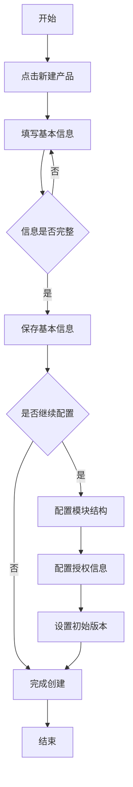
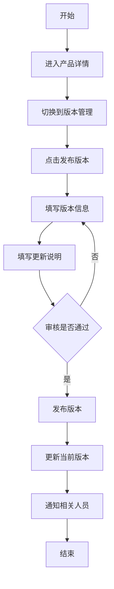
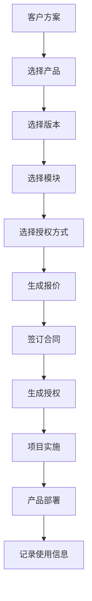

# 软件产品库 PRD

## 📋 文档信息

| 项目       | 内容                     |
| ---------- | ------------------------ |
| 文档名称   | 软件产品库功能需求文档   |
| 文档版本   | V1.0                     |
| 创建日期   | 2025-11-06               |
| 所属模块   | 产品方案 > 软件产品库    |
| 路由路径   | `/product-solutions/software` |
| 页面组件   | `views/product-solutions/software/index.vue` |

---

## 🎯 功能概述

软件产品库是OMS系统中用于管理公司所有软件产品的核心模块，为公司提供统一的软件产品信息管理平台。该模块支持软件产品的全生命周期管理，包括产品的基础信息维护、状态跟踪、模块结构管理、版本管理和授权信息管理等核心功能。

### 核心价值

- **统一管理**：集中管理公司所有软件产品的基础信息，避免信息分散
- **版本追溯**：完整记录产品各版本信息，支持版本历史追溯
- **模块化管理**：支持产品模块化结构管理，便于灵活组合和销售
- **授权管控**：规范化管理产品授权信息，支持多种授权模式
- **状态追踪**：实时跟踪产品生命周期状态，便于产品规划和决策

---

## 🏢 业务背景

### 业务场景

- **产品经理**：维护产品信息，管理产品版本和模块
- **销售人员**：查询产品信息，了解产品功能和授权方式
- **技术团队**：查看产品技术规格和模块结构
- **客户服务**：查询客户使用的产品版本和授权信息
- **管理层**：了解产品矩阵，制定产品战略

---

## 👥 用户角色

| 角色       | 权限                                       | 使用场景                     |
| ---------- | ------------------------------------------ | ---------------------------- |
| 产品经理   | 增删改查、版本管理、模块管理               | 产品全生命周期管理           |
| 销售人员   | 查看、导出                                 | 查询产品信息，制定销售方案   |
| 技术人员   | 查看、模块查看                             | 了解产品技术架构和模块       |
| 客服人员   | 查看、授权信息查看                         | 客户咨询服务                 |
| 系统管理员 | 所有权限                                   | 系统维护和数据管理           |

---

## ⚙️ 功能需求

### 1. 产品列表页

#### 1.1 页面布局

```
┌─────────────────────────────────────────────────────────────┐
│  软件产品库                                         [+ 新建产品] │
├─────────────────────────────────────────────────────────────┤
│  搜索筛选区                                                   │
│  ┌──────────────────────────────────────────────────────┐   │
│  │ 产品名称: [_______] 产品编码: [_______] 产品分类: [▼]  │   │
│  │ 产品状态: [▼] 授权方式: [▼]  [🔍 搜索] [重置]         │   │
│  └──────────────────────────────────────────────────────┘   │
├─────────────────────────────────────────────────────────────┤
│  操作栏: [批量删除]                                          │
├─────────────────────────────────────────────────────────────┤
│  数据表格                                                     │
│  ┌──┬────────┬────────┬──────┬────┬──────┬────────────┐   │
│  │☐│产品编码 │产品名称 │分类   │状态 │最新版本│操作        │   │
│  ├──┼────────┼────────┼──────┼────┼──────┼────────────┤   │
│  │☐│PRD-001 │OMS系统  │管理类 │在售 │v2.1.0 │查看编辑删除│   │
│  │☐│PRD-002 │ERP系统  │管理类 │在售 │v3.0.5 │查看编辑删除│   │
│  └──┴────────┴────────┴──────┴────┴──────┴────────────┘   │
│  共 25 条 [1] 2 3 4 5 ...                                   │
└─────────────────────────────────────────────────────────────┘
```

#### 1.2 搜索筛选功能

**筛选字段：**

| 字段       | 类型         | 说明               |
| ---------- | ------------ | ------------------ |
| 产品名称   | 文本输入     | 支持模糊搜索       |
| 产品编码   | 文本输入     | 支持模糊搜索       |
| 产品分类   | 下拉选择     | 单选               |
| 产品状态   | 下拉选择     | 单选，支持多选     |
| 授权方式   | 下拉选择     | 单选               |

**搜索规则：**
- 支持组合条件搜索
- 支持重置所有筛选条件

#### 1.3 数据表格

**表格列配置：**

| 列名           | 宽度   | 说明                       | 是否可排序 |
| -------------- | ------ | -------------------------- | ---------- |
| 复选框         | 50px   | 支持批量操作               | -          |
| 产品编码       | 120px  | 唯一标识                   | ✓          |
| 产品名称       | 200px  | 支持点击查看详情           | ✓          |
| 产品分类       | 120px  | 显示分类名称               | ✓          |
| 产品状态       | 100px  | 显示状态标签（带颜色）     | ✓          |
| 最新版本       | 100px  | 显示当前版本号             | ✓          |
| 授权方式       | 120px  | 显示授权类型               | ✓          |
| 模块数量       | 80px   | 显示包含模块数             | ✓          |
| 创建时间       | 150px  | 格式：YYYY-MM-DD HH:mm:ss  | ✓          |
| 更新时间       | 150px  | 格式：YYYY-MM-DD HH:mm:ss  | ✓          |
| 操作           | 200px  | 查看/编辑/版本/模块/删除   | -          |

**表格功能：**
- 支持列排序
- 支持列显示/隐藏配置
- 支持列宽度调整
- 支持分页（每页10/20/50/100条）
- 支持行选择（单选/多选）
- 支持快速查看（点击行展开详情）

#### 1.4 批量操作

- **批量删除**：删除选中的产品（需二次确认）

---

### 2. 产品详情/编辑页

#### 2.1 页面布局

采用标签页（Tab）布局，分为以下几个部分：

```
┌─────────────────────────────────────────────────────────────┐
│  [< 返回]  产品详情 - OMS运营管理系统          [编辑] [删除]  │
├─────────────────────────────────────────────────────────────┤
│  [基本信息] [模块结构] [版本管理] [其他信息] [使用记录]      │
├─────────────────────────────────────────────────────────────┤
│  (标签页内容区域)                                             │
│                                                               │
│                                                               │
│                                                               │
│                                                               │
└─────────────────────────────────────────────────────────────┘
```

#### 2.2 基本信息标签页

**表单字段：**

| 字段分组       | 字段名称       | 字段类型       | 是否必填 | 说明                           |
| -------------- | -------------- | -------------- | -------- | ------------------------------ |
| **基础信息**   | 产品编码       | 文本输入       | 是       | 自动生成或手动输入，唯一       |
|                | 产品名称       | 文本输入       | 是       | 最多100字符                    |
|                | 产品简称       | 文本输入       | 否       | 最多50字符                     |
|                | 产品分类       | 下拉选择       | 是       | 从字典表获取                   |
|                | 产品状态       | 单选按钮       | 是       | 在研/在售/停售/已下线          |
|                | 产品图标       | 图片上传       | 否       | 支持png/jpg，最大2MB           |
|                | 产品简介       | 富文本编辑器   | 否       | 最多500字                      |
| **技术信息**   | 技术架构       | 下拉选择       | 否       | B/S、C/S、混合架构等           |
|                | 开发语言       | 多选下拉       | 否       | Java、Python、Vue等            |
|                | 数据库类型     | 多选下拉       | 否       | MySQL、Oracle、PostgreSQL等    |
|                | 部署方式       | 多选下拉       | 否       | 本地部署、云端部署、混合部署   |
|                | 运行环境       | 文本输入       | 否       | 操作系统、依赖环境等           |
| **商务信息**   | 所属产品线     | 下拉选择       | 否       | 从产品线字典选择               |
|                | 产品负责人     | 用户选择器     | 是       | 从组织架构选择                 |
|                | 技术负责人     | 用户选择器     | 是       | 从组织架构选择                 |
|                | 支持授权类型   | 多选下拉       | 否       | 订阅模式/永久授权/按量计费   |
|                | 授权价格配置   | 表格输入       | 否       | 针对不同授权类型维护价格和单位 |
|                | 市场定位       | 文本域         | 否       | 目标市场、客户群体等           |
|                | 竞争优势       | 文本域         | 否       | 产品核心竞争力                 |
| **其他信息**   | 官网地址       | URL输入        | 否       | 产品官网                       |
|                | 演示地址       | URL输入        | 否       | 在线演示地址                   |
|                | 备注说明       | 文本域         | 否       | 其他补充说明                   |
|                | 标签           | 标签输入       | 否       | 多个标签，用于分类和搜索       |

**字段验证规则：**

```javascript
// 产品编码验证
productCode: {
  required: true,
  pattern: /^PRD-[A-Z0-9]{3,20}$/,
  message: '产品编码格式：PRD-XXX，字母数字组合'
}

// URL验证
url: {
  pattern: /^https?:\/\/.+/,
  message: '请输入有效的URL地址'
}

// 授权价格配置结构示例
authorizationPrices: [
  {
    type: '订阅模式',
    price: 10000,
    unit: '元/月'
  },
  {
    type: '永久授权',
    price: 500000,
    unit: '元/套'
  }
]
```

#### 2.3 模块结构标签页

**功能说明：**
- 以树形结构展示产品的模块组成
- 支持多级模块嵌套（模块 → 子模块 → 子模块...）
- 每个模块可独立管理和配置
- 左右分栏布局，左侧树形展示，右侧详情编辑
- 支持拖拽排序和模块复制

**页面布局：**（左右分栏，比例 1:3）

```
┌───────────────────────┬─────────────────────────────────────────────┐
│ 模块结构   [+ 添加模块]│ [模块信息] [功能列表]                        │
├───────────────────────┼─────────────────────────────────────────────┤
│ 📦 系统管理            │ 模块名称: [系统管理                    ]    │
│   └─ 用户认证    ⊕⎘✕  │ 模块类型: [模块 ▼]                          │
│   └─ 权限管理    ⊕⎘✕  │ 是否必选: [✓] 必选                          │
│                       │ 模块描述: [用户、角色、权限管理...     ]    │
│ 📦 业务管理            │                                             │
│   └─ 订单管理    ⊕⎘✕  │ ─── 功能列表 ───         [添加功能]         │
│     └─ 订单创建  ⊕⎘✕  │ ┌───────────┬──────────────┬────────┐      │
│     └─ 订单审核  ⊕⎘✕  │ │ 功能名称   │ 功能描述      │ 操作    │      │
│   └─ 库存管理    ⊕⎘✕  │ ├───────────┼──────────────┼────────┤      │
│                       │ │ 用户登录   │ 支持多种登录  │ 编辑 删除│      │
│ 📦 报表模块            │ │ 密码找回   │ 邮箱/短信找回 │ 编辑 删除│      │
│   └─ 财务报表    ⊕⎘✕  │ └───────────┴──────────────┴────────┘      │
│   └─ 业务报表    ⊕⎘✕  │                                             │
└───────────────────────┴─────────────────────────────────────────────┘

操作说明：
- ⊕ 添加子节点  ⎘ 复制  ✕ 删除
- 操作按钮仅在鼠标悬停时显示
- 支持拖拽节点进行排序和调整层级
- 模块不能拖动到子模块下
```

**模块字段：**

| 字段名称       | 字段类型       | 是否必填 | 说明                           |
| -------------- | -------------- | -------- | ------------------------------ |
| 模块名称       | 文本输入       | 是       | 最多50字符                     |
| 模块类型       | 下拉选择       | 是       | 模块/子模块                    |
| 是否必选       | 开关           | 是       | 是否为必选模块                 |
| 模块描述       | 文本域         | 否       | 模块功能描述                   |
| 功能清单       | 表格列表       | 否       | 该模块包含的具体功能点         |

**功能字段：**

| 字段名称       | 字段类型       | 是否必填 | 说明                           |
| -------------- | -------------- | -------- | ------------------------------ |
| 功能名称       | 文本输入       | 是       | 功能的名称                     |
| 功能描述       | 文本域         | 否       | 功能的详细描述                 |

**模块操作：** 

- ✅ **添加模块**：点击顶部"添加模块"按钮，添加根级模块
- ✅ **添加子模块**：点击节点的"⊕"按钮，在该节点下添加子模块
  - 子模块可以嵌套子模块
  - 模块树最多支持10层级嵌套
  - 自动设置子模块类型
- ✅ **编辑模块信息**：
  - 点击树节点，右侧显示模块详情
  - 进入编辑模式后可修改模块信息
  - 保存后自动更新树形结构
- ✅ **删除模块**：点击节点的"✕"按钮
  - 弹出确认对话框
  - 提示：删除后子模块一并删除
  - 确认后删除节点及其所有子节点
- ✅ **拖拽排序**：
  - 编辑模式下支持拖拽节点
  - 可调整节点顺序
  - 可调整节点层级
  - 限制：根节点只能是模块；模块不能拖动到子模块下，模块不能拖动套模块下；
  - 拖拽时有视觉反馈
- ✅ **复制模块结构**：点击节点的"⎘"按钮
  - 复制节点及其所有子节点
  - 自动在标题后添加"（副本）"
  - 自动生成新的节点Key

**功能管理：** 

- ✅ **添加功能**：在"功能列表"标签页点击"添加功能"按钮
  - 弹出功能编辑对话框
  - 仅显示功能相关字段（功能名称、功能描述）
- ✅ **编辑功能**：点击功能表格中的"编辑"按钮
  - 弹出功能编辑对话框
  - 标题显示"编辑功能"
- ✅ **删除功能**：点击功能表格中的"删除"按钮
  - 弹出确认对话框："确定要删除功能"XXX"吗？"
  - 确认后删除功能

**交互细节：** 

- ✅ **节点操作按钮**：
  - 默认隐藏，鼠标悬停时显示
  - 显示在节点右侧，不遮挡文字
  - 使用扁平风格图标：⊕（添加）、⎘（复制）、✕（删除）
  - 鼠标悬停图标显示Tooltip说明
- ✅ **编辑模式切换**：
  - 查看模式：树节点只读，不显示操作按钮
  - 编辑模式：可拖拽，显示操作按钮，右侧可编辑
- ✅ **节点选择**：
  - 点击节点，右侧显示对应的详情信息
  - 选中节点高亮显示
- ✅ **标签页切换**：
  - "模块信息"标签页：显示模块基本信息表单
  - "功能列表"标签页：显示功能表格
- ✅ **空状态处理**：
  - 未选择节点时：显示"请在左侧选择一个节点"
  - 无功能数据时：显示"暂无功能"


#### 2.4 其他信息标签页

**表单字段：**

| 字段名称       | 字段类型       | 是否必填 | 说明                           |
| -------------- | -------------- | -------- | ------------------------------ |
| 官网地址       | URL输入        | 否       | 产品官网                       |
| 演示地址       | URL输入        | 否       | 在线演示地址                   |
| 标签           | 标签输入       | 否       | 多个标签，用于分类和搜索       |
| 备注说明       | 文本域         | 否       | 其他补充说明                   |

#### 2.5 使用记录标签页

**功能说明：**
- 展示该产品在各个项目中的使用情况
- 关联到客户方案和项目

**页面内容：**

| 列名           | 说明                       |
| -------------- | -------------------------- |
| 客户名称       | 使用该产品的客户           |
| 项目名称       | 项目名称                   |
| 使用版本       | 使用的产品版本             |
| 授权方式       | 采用的授权类型             |
| 授权数量       | 授权用户数/并发数等        |
| 部署时间       | 产品部署上线时间           |
| 运行状态       | 运行中/已停用              |
---

### 3. 新建/编辑产品

#### 3.1 新建产品

点击"新建产品"按钮，打开新建产品弹窗或新页面：

**步骤1：填写基本信息**
- 必填字段：产品编码、产品名称、产品分类、产品状态、产品负责人、技术负责人
- 可选字段：其他所有基本信息字段

**步骤2：配置模块结构（可选）**
- 可以跳过，后续补充
- 也可以立即添加产品模块

**步骤3：设置授权信息（可选）**
- 可以跳过，后续补充
- 也可以立即配置授权策略

**保存逻辑：**
- 点击"保存"：保存产品信息，返回列表
- 点击"保存并继续"：保存产品信息，继续添加模块/版本
- 点击"取消"：放弃本次操作，返回列表

#### 3.2 编辑产品

在产品列表或详情页点击"编辑"按钮：

- 表单同新建产品
- 显示已有数据
- 支持修改所有字段（产品编码可能不可修改，根据业务规则）
- 记录修改历史

#### 3.3 表单验证

**前端验证：**
- 必填字段验证
- 格式验证（URL、编码格式等）
- 长度限制验证
- 数字范围验证

**后端验证：**
- 产品编码唯一性验证
- 权限验证
- 数据完整性验证

---

### 4. 删除产品

#### 4.1 删除条件

- 产品未被任何客户方案使用
- 产品未被任何项目使用
- 有删除权限的用户才能删除

#### 4.2 删除流程

1. 点击删除按钮
2. 系统检查产品是否可删除
3. 如果产品被使用，提示不能删除并显示使用情况
4. 如果可删除，弹出二次确认对话框
5. 用户确认后执行删除
6. 删除成功后返回列表并提示

#### 4.3 软删除

- 采用软删除机制，数据不真实删除
- 删除后的产品不在列表中显示

---

### 5. 导出

#### 5.1 导出功能

**导出内容：**
- 产品基本信息
- 模块结构（可选）
- 版本信息（可选）
- 授权信息（可选）

**导出格式：**
- Excel（.xlsx）
- CSV
- PDF（仅用于打印）

**导出方式：**
- 导出当前页
- 导出全部
- 自定义导出（选择导出字段）

**数据验证：**
- 必填字段验证
- 格式验证
- 重复数据验证
- 关联数据验证

---

## 📊 数据字段定义

### 主表：software_products（软件产品表）

| 字段名              | 类型         | 长度 | 必填 | 说明                     |
| ------------------- | ------------ | ---- | ---- | ------------------------ |
| id                  | bigint       | -    | 是   | 主键ID                   |
| product_code        | varchar      | 50   | 是   | 产品编码（唯一）         |
| product_name        | varchar      | 100  | 是   | 产品名称                 |
| product_short_name  | varchar      | 50   | 否   | 产品简称                 |
| product_name_en     | varchar      | 100  | 否   | 产品英文名               |
| product_category_id | bigint       | -    | 是   | 产品分类ID               |
| product_status      | tinyint      | -    | 是   | 产品状态：1在研/2在售/3停售/4已下线 |
| product_icon        | varchar      | 255  | 否   | 产品图标URL              |
| product_intro       | text         | -    | 否   | 产品简介                 |
| tech_architecture   | varchar      | 50   | 否   | 技术架构                 |
| dev_languages       | varchar      | 200  | 否   | 开发语言（逗号分隔）     |
| database_types      | varchar      | 100  | 否   | 数据库类型（逗号分隔）   |
| deploy_modes        | varchar      | 100  | 否   | 部署方式（逗号分隔）     |
| runtime_env         | varchar      | 255  | 否   | 运行环境                 |
| product_line_id     | bigint       | -    | 否   | 所属产品线ID             |
| product_manager_id  | bigint       | -    | 是   | 产品负责人ID             |
| tech_manager_id     | bigint       | -    | 是   | 技术负责人ID             |
| sales_manager_id    | bigint       | -    | 否   | 销售负责人ID             |
| market_position     | text         | -    | 否   | 市场定位                 |
| competitive_edge    | text         | -    | 否   | 竞争优势                 |
| website_url         | varchar      | 255  | 否   | 官网地址                 |
| demo_url            | varchar      | 255  | 否   | 演示地址                 |
| doc_url             | varchar      | 255  | 否   | 文档地址                 |
| repo_url            | varchar      | 255  | 否   | 源码仓库地址             |
| current_version     | varchar      | 50   | 否   | 当前版本号               |
| tags                | varchar      | 255  | 否   | 标签（逗号分隔）         |
| remark              | text         | -    | 否   | 备注说明                 |
| is_deleted          | tinyint      | -    | 是   | 是否删除：0否/1是        |
| create_by           | bigint       | -    | 是   | 创建人ID                 |
| create_time         | datetime     | -    | 是   | 创建时间                 |
| update_by           | bigint       | -    | 是   | 更新人ID                 |
| update_time         | datetime     | -    | 是   | 更新时间                 |

**索引：**
- PRIMARY KEY (`id`)
- UNIQUE KEY `uk_product_code` (`product_code`)
- KEY `idx_product_name` (`product_name`)
- KEY `idx_category` (`product_category_id`)
- KEY `idx_status` (`product_status`)
- KEY `idx_create_time` (`create_time`)

---

### 子表1：product_modules（产品模块表）

| 字段名         | 类型     | 长度 | 必填 | 说明                           |
| -------------- | -------- | ---- | ---- | ------------------------------ |
| id             | bigint   | -    | 是   | 主键ID                         |
| product_id     | bigint   | -    | 是   | 产品ID                         |
| module_code    | varchar  | 50   | 是   | 模块编码                       |
| module_name    | varchar  | 100  | 是   | 模块名称                       |
| module_group   | varchar  | 50   | 是   | 模块分组：基础/核心/扩展       |
| is_required    | tinyint  | -    | 是   | 是否必选：0否/1是              |
| parent_id      | bigint   | -    | 否   | 父级模块ID                     |
| module_desc    | text     | -    | 否   | 模块描述                       |
| function_list  | text     | -    | 否   | 功能清单（JSON）               |
| tech_dependency| varchar  | 500  | 否   | 技术依赖                       |
| dev_status     | tinyint  | -    | 是   | 开发状态：1已完成/2开发中/3计划中 |
| sort_order     | int      | -    | 否   | 排序                           |
| is_deleted     | tinyint  | -    | 是   | 是否删除：0否/1是              |
| create_by      | bigint   | -    | 是   | 创建人ID                       |
| create_time    | datetime | -    | 是   | 创建时间                       |
| update_by      | bigint   | -    | 是   | 更新人ID                       |
| update_time    | datetime | -    | 是   | 更新时间                       |

**索引：**
- PRIMARY KEY (`id`)
- KEY `idx_product_id` (`product_id`)
- KEY `idx_parent_id` (`parent_id`)

---

### 子表2：product_versions（产品版本表）

| 字段名              | 类型     | 长度 | 必填 | 说明                           |
| ------------------- | -------- | ---- | ---- | ------------------------------ |
| id                  | bigint   | -    | 是   | 主键ID                         |
| product_id          | bigint   | -    | 是   | 产品ID                         |
| version_number      | varchar  | 50   | 是   | 版本号                         |
| version_name        | varchar  | 100  | 否   | 版本名称                       |
| release_type        | tinyint  | -    | 是   | 发布类型：1重大更新/2功能更新/3问题修复 |
| release_date        | date     | -    | 是   | 发布日期                       |
| release_status      | tinyint  | -    | 是   | 发布状态：1开发中/2测试中/3已发布/4已归档 |
| update_content      | text     | -    | 是   | 更新内容                       |
| new_features        | text     | -    | 否   | 新增功能（JSON数组）           |
| optimizations       | text     | -    | 否   | 优化项（JSON数组）             |
| bug_fixes           | text     | -    | 否   | 修复问题（JSON数组）           |
| compatibility_note  | text     | -    | 否   | 兼容性说明                     |
| upgrade_guide       | text     | -    | 否   | 升级指南                       |
| doc_url             | varchar  | 255  | 否   | 文档地址                       |
| is_current          | tinyint  | -    | 是   | 是否当前版本：0否/1是          |
| release_by          | bigint   | -    | 是   | 发布人ID                       |
| remark              | text     | -    | 否   | 备注                           |
| is_deleted          | tinyint  | -    | 是   | 是否删除：0否/1是              |
| create_by           | bigint   | -    | 是   | 创建人ID                       |
| create_time         | datetime | -    | 是   | 创建时间                       |
| update_by           | bigint   | -    | 是   | 更新人ID                       |
| update_time         | datetime | -    | 是   | 更新时间                       |

**索引：**
- PRIMARY KEY (`id`)
- KEY `idx_product_id` (`product_id`)
- KEY `idx_version_number` (`version_number`)
- KEY `idx_release_date` (`release_date`)

---

### 子表3：product_licenses（产品授权表）

| 字段名           | 类型     | 长度 | 必填 | 说明                           |
| ---------------- | -------- | ---- | ---- | ------------------------------ |
| id               | bigint   | -    | 是   | 主键ID                         |
| product_id       | bigint   | -    | 是   | 产品ID                         |
| license_type     | varchar  | 50   | 是   | 授权类型：永久/订阅/试用/OEM等 |
| license_mode     | varchar  | 50   | 是   | 授权模式：按用户数/按并发数等  |
| license_price    | decimal  | 10,2 | 否   | 授权价格                       |
| price_unit       | varchar  | 20   | 否   | 价格单位                       |
| valid_days       | int      | -    | 否   | 有效期（天）                   |
| min_users        | int      | -    | 否   | 最小用户数                     |
| max_users        | int      | -    | 否   | 最大用户数，0表示不限          |
| included_modules | text     | -    | 否   | 包含模块（JSON数组）           |
| license_desc     | text     | -    | 否   | 授权说明                       |
| contract_template| varchar  | 255  | 否   | 合同模板文件地址               |
| is_enabled       | tinyint  | -    | 是   | 是否启用：0否/1是              |
| sort_order       | int      | -    | 否   | 排序                           |
| is_deleted       | tinyint  | -    | 是   | 是否删除：0否/1是              |
| create_by        | bigint   | -    | 是   | 创建人ID                       |
| create_time      | datetime | -    | 是   | 创建时间                       |
| update_by        | bigint   | -    | 是   | 更新人ID                       |
| update_time      | datetime | -    | 是   | 更新时间                       |

**索引：**
- PRIMARY KEY (`id`)
- KEY `idx_product_id` (`product_id`)
- KEY `idx_license_type` (`license_type`)

---

## 🔄 业务流程

### 1. 产品创建流程



### 2. 版本发布流程



### 3. 产品使用流程



---

## 📝 操作日志

后台记录以下关键操作：

| 操作类型       | 记录内容                           |
| -------------- | ---------------------------------- |
| 创建产品       | 产品信息、操作人、操作时间         |
| 编辑产品       | 修改字段、修改前后值、操作人       |
| 删除产品       | 产品信息、操作人、操作时间         |
| 发布版本       | 版本信息、操作人、操作时间         |
| 添加模块       | 模块信息、操作人、操作时间         |
| 配置授权       | 授权信息、操作人、操作时间         |
| 导出数据       | 导出条件、导出数量、操作人         |

---

## 🚀 迭代路线

### 第一期（当前版本）
- ✅ 产品基础信息管理
- ✅ 模块结构管理
- ✅ 其他信息管理
- ✅ 使用记录展示

### 第二期
- 📋 批量导出功能（批量导出选中产品信息为Excel）
- 📋 版本管理功能
- 📋 产品对比功能（多个产品横向对比）
- 📋 产品组合推荐（智能推荐产品组合方案）
- 📋 产品使用分析（统计分析产品使用情况）
- 📋 产品评价反馈（收集客户对产品的评价）
- 📋 产品相关信息变动后发通知到对应角色人员
- 📋 高级授权管理：
  - 支持更多授权方式（如并发用户数、点数授权等）
  - 支持模块级授权颗粒度（可针对特定模块单独授权）
  - 授权策略配置（不同模块组合的定价策略）

### 第三期
- 📋 产品知识库（关联产品文档、FAQ等）
- 📋 产品培训资料管理
- 📋 产品演示视频管理
- 📋 产品路线图展示

### 第四期
- 📋 AI智能推荐（基于客户需求推荐产品）
- 📋 产品健康度评估（基于使用数据评估产品）
- 📋 竞品分析对比
- 📋 市场趋势分析

---

## 📚 相关文档

- [硬件设备库PRD](./硬件设备库.md)
- [服务库PRD](./服务库.md)
- [方案模板PRD](./方案模板.md)
- [客户方案PRD](./客户方案.md)
- [API接口文档](../API文档/产品方案API.md)
- [数据库设计文档](../数据库设计/产品方案数据库.md)

---

## ✅ 验收标准

### 功能验收

- [ ] 可以正常创建、编辑、删除产品
- [ ] 支持产品列表的搜索和筛选
- [ ] 支持产品模块结构的管理
- [ ] 支持查看产品使用记录
- [ ] 所有表单验证正常工作
- [ ] 权限控制正常工作

### 界面验收

- [ ] 界面美观、布局合理
- [ ] 移动端响应式正常
- [ ] 交互流畅、用户体验良好
- [ ] 错误提示友好清晰


---

**文档变更历史**

| 版本 | 日期       | 修改人 | 修改内容     |
| ---- | ---------- | ------ | ------------ |
| V1.0 | 2025-11-06 | 张伟 | 初始版本创建 |

