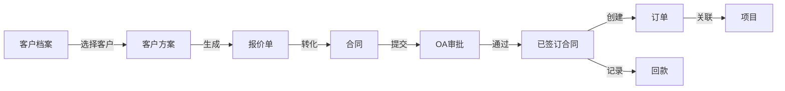

# 合同订单管理 PRD v1.0

## 文档信息

| 项目 | 内容 |
|------|------|
| 产品名称 | 合同订单管理 |
| 文档版本 | v1.0 |
| 编写人 | 产品团队 |
| 创建日期 | 2025-11-12 |
| 最后更新 | 2025-01-XX |
| 状态 | 进行中 |
| 更新说明 | 已完成回款记录添加功能,使用右侧抽屉实现 |

## 一、产品概述

### 1.1 背景说明

在销售业务流程中，合同和订单是客户关系管理的关键环节。当商机推进到成交阶段后,需要将客户方案和报价单转化为正式合同,经过审批后签订执行。合同签订后需要创建订单进行交付跟踪,同时需要管理合同回款情况。

目前面临的主要挑战:
- **回款跟踪困难**:回款信息更新不及时,应收账款统计不准确
- **订单状态不清**:订单执行进度不明确,交付过程难以追踪
- **数据不互通**:合同、订单、回款信息孤立,难以形成完整业务视图

为解决上述问题,需要建设统一的合同订单管理模块,实现从合同签订、审批、回款到订单执行的全流程管理。

### 1.2 核心概念说明

| 概念 | 说明 | 关键特征 |
|------|------|---------|
| **合同** | 与客户签订的正式商务协议 | 需要审批、具有法律效力、关联回款 |
| **订单** | 基于合同创建的交付执行单据 | 跟踪交付进度、管理实施过程 |
| **回款** | 合同款项的收款记录 | 包含收款时间、金额、方式等 |
| **合同审批** | 合同提交OA系统走审批流程 | 多级审批、审批状态同步 |

**业务流程关系:**
```
商机 → 客户方案 → 报价单 → 合同 → 合同审批 → 订单 → 项目实施
                                      ↓
                                    回款管理
```

### 1.3 产品目标

1. **统一合同管理**:建立完整的合同管理体系,实现合同信息标准化
2. **流程自动化**:与OA系统对接,实现合同审批流程自动化
3. **回款透明化**:实时跟踪回款情况,提高回款管理效率
4. **订单可视化**:清晰展示订单状态,便于跟踪交付进度
5. **数据一体化**:打通合同、订单、回款数据,形成完整业务视图

## 二、功能架构

### 2.1 模块结构

```
合同订单管理
├── 合同管理
│   ├── 合同列表
│   ├── 合同详情
│   ├── 合同创建/编辑
│   ├── 合同审批
│   └── 回款管理
└── 订单管理
    ├── 订单列表
    ├── 订单详情
    └── 订单创建/编辑
```

### 2.2 业务流程图

```
┌─────────────────────────────────────────────────────────────┐
│                    合同订单业务流程                          │
└─────────────────────────────────────────────────────────────┘

开始
 │
 ├──► 基于客户方案/报价单创建合同
 │    ├─► 填写合同基本信息
 │    ├─► 关联客户方案
 │    ├─► 设置合同金额
 │    └─► 添加合同条款
 │
 ├──► 提交合同审批
 │    ├─► 同步到OA系统
 │    ├─► 走审批流程
 │    └─► 同步审批状态
 │
 ├──► 合同审批通过
 │    ├─► 合同状态变更为已签订
 │    └─► 生成合同编号
 │
 ├──► 创建订单
 │    ├─► 基于合同创建
 │    ├─► 设置交付信息
 │    └─► 跟踪订单状态
 │
 ├──► 管理回款
 │    ├─► 记录回款信息
 │    ├─► 更新回款进度
 │    └─► 统计回款率
 │
 └──► 结束
```

### 2.3 模块关系



## 三、功能需求

### 3.1 合同列表页

#### 3.1.1 页面功能说明

展示所有合同的列表信息,支持多条件查询、筛选、排序、分页等功能。用户可以查看合同基本信息、快速定位目标合同、进行合同的新增、编辑、删除等操作。

#### 3.1.2 界面布局

```
┌───────────────────────────────────────────────────────────────────────────┐
│  合同管理                                                                  │
│  [+ 新建合同] [批量导出]                                        [导出]     │
├───────────────────────────────────────────────────────────────────────────┤
│  搜索条件:                                                                 │
│  ┌──────────────────┐ ┌──────────┐ ┌──────────┐ ┌──────────┐            │
│  │关键字(名称/编号)│ │客户名称  │ │合同状态  │ │审批状态  │            │
│  └──────────────────┘ └──────────┘ └──────────┘ └──────────┘            │
│  ┌──────────┐ ┌──────────┐                                               │
│  │签订日期  │ │负责人    │ [搜索] [重置]                                 │
│  └──────────┘ └──────────┘                                               │
├───────────────────────────────────────────────────────────────────────────┤
│ □ 合同编号│合同名称│客户│金额(万)│签订日期│状态│审批│回款率│操作       │
├───────────────────────────────────────────────────────────────────────────┤
│ □ HT-001 │XX项目 │XX科技│200.00│2024-10-15│已签订│通过│75%│查看 编辑│
│ □ HT-002 │YY项目 │YY集团│150.00│2024-11-01│审批中│进行│0%│查看      │
│ □ HT-003 │ZZ项目 │ZZ企业│300.00│2024-11-10│草稿  │-  │0%│查看 编辑│
├───────────────────────────────────────────────────────────────────────────┤
│ 共 50 条记录  [1] 2 3 4 5                                 每页20条 ▼     │
└───────────────────────────────────────────────────────────────────────────┘
```

#### 3.1.3 功能点说明

- 支持按关键字(合同名称或编号)、客户名称、合同状态、审批状态、签订日期、负责人等条件搜索
- 关键字搜索支持模糊匹配,同时匹配合同名称和合同编号
- 列表每行前含复选框,支持批量选择和批量导出
- 所有列均支持升序/降序排序
- 每页显示20条数据,可分页查看(支持10/20/50/100条切换)
- 合同金额以"万"为单位显示,保留两位小数
- 回款率以百分比显示,自动计算(已回款金额/合同金额×100%)
- 合同状态采用颜色标签展示(草稿-灰色、审批中-蓝色、已签订-绿色、已完成-绿色、已终止-红色)
- 审批状态采用颜色标签展示(待提交-灰色、审批中-蓝色、已通过-绿色、已驳回-红色)
- 点击合同编号可进入详情页
- 新建合同支持从客户方案或报价单快速创建

#### 3.1.4 表格列定义

| 列名 | 说明 | 宽度 | 排序 |
|------|------|------|------|
| 复选框 | 批量选择 | 50px | - |
| 合同编号 | HT-YYYYMMDD-XXX格式 | 150px | ✓ |
| 合同名称 | 合同标题 | 200px | ✓ |
| 客户名称 | 关联客户 | 150px | ✓ |
| 合同金额(万) | 以万为单位,保留2位小数 | 120px | ✓ |
| 签订日期 | YYYY-MM-DD | 120px | ✓ |
| 合同状态 | 草稿/审批中/已签订/已完成/已终止 | 100px | ✓ |
| 审批状态 | 待提交/审批中/已通过/已驳回 | 100px | ✓ |
| 回款率 | 百分比显示 | 80px | ✓ |
| 负责人 | 合同负责人姓名 | 100px | - |
| 操作 | 查看/编辑/删除/提交审批 | 200px | - |

#### 3.1.5 关键操作流程

**新建合同流程:**
1. 用户点击"新建合同"按钮
2. 弹出创建方式选择对话框:
   - 从客户方案创建
   - 从报价单创建  
   - 手动创建
3. 选择创建方式后跳转到合同编辑页
4. 系统自动填充相关信息(如选择方案/报价单)
5. 用户完善合同信息
6. 保存为草稿或提交审批

**提交审批流程:**
1. 用户在列表页或详情页点击"提交审批"按钮
2. 系统校验合同信息完整性
3. 弹出确认对话框,显示审批流程预览
4. 用户确认后,系统调用OA接口创建审批流程
5. 合同状态更新为"审批中"
6. 系统定时同步审批状态

**删除合同流程:**
1. 用户点击"删除"按钮
2. 系统校验:
   - 只有草稿状态的合同可以删除
   - 已有订单的合同不可删除
3. 弹出确认对话框
4. 用户确认后执行删除
5. 刷新列表页

#### 3.1.6 业务规则

- 合同编号自动生成,格式:HT-YYYYMMDD-XXX(HT=合同拼音首字母)
- 只有草稿状态的合同可以编辑和删除
- 审批通过的合同不可修改基本信息(可补充回款信息)
- 已有订单的合同不可删除
- 回款率自动计算,不可手动修改
- 合同金额必须大于0
- 签订日期不能早于创建日期

#### 3.1.7 字段定义

| 字段名称 | 类型 | 是否必填 | 长度/精度 | 说明 |
|----------|------|----------|-----------|------|
| 合同编号 | 字符串 | 是 | 长度20 | 系统自动生成,格式:HT-YYYYMMDD-XXX |
| 合同名称 | 字符串 | 是 | 长度100 | 合同标题 |
| 客户名称 | 字符串 | 是 | 长度100 | 关联客户名称 |
| 合同金额 | 数值 | 是 | 精度2 | 合同总金额(元),列表展示时以万为单位 |
| 已回款金额 | 数值 | 否 | 精度2 | 已收款金额(元),自动计算 |
| 未回款金额 | 数值 | 否 | 精度2 | 未收款金额(元),自动计算 |
| 回款率 | 数值 | 否 | 精度2 | 回款百分比,自动计算 |
| 签订日期 | 日期 | 是 | - | YYYY-MM-DD格式 |
| 合同状态 | 枚举 | 是 | - | 草稿/审批中/已签订/已完成/已终止 |
| 审批状态 | 枚举 | 是 | - | 待提交/审批中/已通过/已驳回 |
| 合同负责人 | 字符串 | 是 | 长度30 | 负责人姓名 |
| 创建时间 | 日期时间 | 是 | - | 创建时间 |
| 更新时间 | 日期时间 | 否 | - | 最后更新时间 |

### 3.2 合同详情页

#### 3.2.1 页面功能说明

展示单个合同的完整信息,包括基本信息、关联方案、合同条款、回款记录、关联订单等。支持查看、编辑、审批、回款管理等操作。

#### 3.2.2 界面布局

```
┌─────────────────────────────────────────────────────────────────────────┐
│  ← 返回  XX项目合同                    [编辑] [提交审批] [终止]         │
│  合同编号:HT-20241015-001  [已签订] [审批通过]                          │
├─────────────────────────────────────────────────────────────────────────┤
│  ┌───────────────────────────────────────────────────────────────────┐  │
│  │  合同金额    已回款     未回款     回款率     关联订单   关联项目 │  │
│  │  200.00万   150.00万   50.00万     75%        1个        1个     │  │
│  └───────────────────────────────────────────────────────────────────┘  │
├─────────────────────────────────────────────────────────────────────────┤
│  [基本信息] [关联方案] [合同条款] [回款记录] [关联订单] [审批记录]     │
├─────────────────────────────────────────────────────────────────────────┤
│                                                                          │
│  基本信息                                                                │
│  ┌──────────────────────┐  ┌──────────────────────┐                    │
│  │ 合同编号:            │  │ 合同名称:            │                    │
│  │ HT-20241015-001      │  │ XX项目销售合同       │                    │
│  └──────────────────────┘  └──────────────────────┘                    │
│  ┌──────────────────────┐  ┌──────────────────────┐                    │
│  │ 客户名称:            │  │ 客户方案:            │                    │
│  │ XX科技有限公司 →     │  │ XX智慧工厂方案 →     │                    │
│  └──────────────────────┘  └──────────────────────┘                    │
│  ┌──────────────────────┐  ┌──────────────────────┐                    │
│  │ 合同金额(万):        │  │ 签订日期:            │                    │
│  │ 200.00               │  │ 2024-10-15           │                    │
│  └──────────────────────┘  └──────────────────────┘                    │
│  ┌──────────────────────┐  ┌──────────────────────┐                    │
│  │ 合同开始日期:        │  │ 合同结束日期:        │                    │
│  │ 2024-10-15           │  │ 2025-10-14           │                    │
│  └──────────────────────┘  └──────────────────────┘                    │
│  ┌──────────────────────┐  ┌──────────────────────┐                    │
│  │ 合同负责人:          │  │ 合同状态:            │                    │
│  │ 张三                 │  │ 已签订               │                    │
│  └──────────────────────┘  └──────────────────────┘                    │
│  ┌─────────────────────────────────────────────────┐                   │
│  │ 合同附件:                                        │                   │
│  │ [📄 合同扫描件.pdf] [📄 补充协议.pdf]           │                   │
│  └─────────────────────────────────────────────────┘                   │
│  ┌─────────────────────────────────────────────────┐                   │
│  │ 备注说明:                                        │                   │
│  │ 本合同包含软件开发、硬件采购、实施服务...        │                   │
│  └─────────────────────────────────────────────────┘                   │
│                                                                          │
└─────────────────────────────────────────────────────────────────────────┘
```

#### 3.2.3 标签页内容

**1. 基本信息标签页**
- 合同基本信息(编号、名称、客户、金额、日期等)
- 关联客户方案(可跳转)
- 合同负责人
- 合同状态和审批状态
- 合同附件(支持上传和下载)
- 备注说明

**2. 关联方案标签页**
- 显示关联的客户方案详细信息
- 方案配置清单
- 报价明细
- 支持跳转到方案详情页

**3. 合同条款标签页**
- 付款条款
- 交付条款
- 质保条款
- 违约条款
- 其他条款
- 支持富文本编辑

**4. 回款记录标签页**
```
┌─────────────────────────────────────────────────────────────────┐
│  [+ 添加回款记录]                                               │
├─────────────────────────────────────────────────────────────────┤
│  回款期次 │ 计划回款日期 │ 计划金额 │ 实际回款日期 │ 实际金额 │ 状态 │ 操作 │
├─────────────────────────────────────────────────────────────────┤
│  首款    │ 2024-10-20  │ 60万    │ 2024-10-18  │ 60万    │ 已回 │ 查看 │
│  进度款  │ 2025-01-15  │ 80万    │ 2025-01-20  │ 80万    │ 已回 │ 查看 │
│  尾款    │ 2025-10-14  │ 60万    │ -           │ -       │ 未回 │ 编辑 │
├─────────────────────────────────────────────────────────────────┤
│  合计:计划回款200万   实际回款150万   未回款50万   回款率75%    │
└─────────────────────────────────────────────────────────────────┘
```

**添加回款记录交互说明:**
- 点击"添加回款记录"按钮后,从页面右侧滑出抽屉(宽度600px)
- 抽屉标题显示"添加回款记录"
- 抽屉右上角显示"取消"和"确定"按钮
- 表单包含所有回款信息字段,支持验证和提交
- 保存成功后自动关闭抽屉并刷新列表

**5. 关联订单标签页**
- 显示基于该合同创建的所有订单
- 订单编号、订单名称、订单状态、创建时间
- 支持跳转到订单详情
- 支持新建订单

**6. 审批记录标签页**
- 显示合同审批历史记录
- 审批流程图(待审批→审批中→已通过)
- 审批节点信息(审批人、审批时间、审批意见)
- OA审批流程链接

#### 3.2.4 功能清单

| 功能 | 说明 | 优先级 |
|------|------|--------|
| 查看合同详情 | 展示合同完整信息 | P0 |
| 编辑合同 | 修改合同信息(草稿状态) | P0 |
| 提交审批 | 提交到OA系统审批 | P0 |
| 同步审批状态 | 定时同步OA审批结果 | P0 |
| 添加回款记录 | 记录回款信息 | P0 |
| 上传合同附件 | 上传合同扫描件等 | P0 |
| 创建订单 | 基于合同创建订单 | P0 |
| 终止合同 | 提前终止合同 | P1 |
| 导出合同 | 导出合同信息 | P1 |
| 合同续签 | 基于原合同创建续签合同 | P1 |

#### 3.2.5 关键操作流程

**提交审批流程:**
1. 用户在合同详情页点击"提交审批"按钮
2. 系统校验合同信息完整性:
   - 合同名称、客户、金额、日期必填
   - 合同金额必须大于0
   - 必须上传合同附件
3. 弹出审批流程预览对话框
4. 用户确认后,系统调用OA接口:
   - 创建审批单
   - 上传合同附件
   - 设置审批流程
5. 审批单创建成功后:
   - 合同状态更新为"审批中"
   - 审批状态更新为"审批中"
   - 记录OA审批单号
6. 系统定时同步审批状态(每5分钟)

**添加回款记录流程:**
1. 用户在回款记录标签页点击"添加回款记录"按钮
2. 从右侧滑出回款记录编辑抽屉(宽度600px)
3. 用户填写回款信息:
   - 回款期次(必填,文本输入,如:首款/进度款/尾款/其他,最大长度50字符)
   - 计划回款日期(必填,日期选择器,格式YYYY-MM-DD)
   - 计划回款金额(必填,数值输入,单位:万元,精度2位小数,必须大于0,不能超过合同金额)
   - 实际回款日期(可选,日期选择器,格式YYYY-MM-DD)
   - 实际回款金额(可选,数值输入,单位:万元,精度2位小数,必须大于0,实际回款总额不能超过合同金额)
   - 回款方式(可选,下拉选择:银行转账/支票/现金/其他)
   - 回款凭证(可选,文件上传,支持PDF/Word/Excel/图片等格式)
   - 备注说明(可选,多行文本,最大长度500字符)
4. 点击"确定"按钮,系统验证表单:
   - 验证必填项是否填写
   - 验证金额是否大于0
   - 验证计划回款金额是否超过合同金额
   - 验证实际回款总额是否超过合同金额
5. 验证通过后保存:
   - 转换金额单位(万元→元)
   - 根据是否有实际回款金额设置回款状态(有实际金额=已回款,无实际金额=未回款)
   - 生成回款记录ID
   - 记录创建时间和创建人
6. 保存成功后:
   - 回款记录添加到列表
   - 自动重新计算合同回款统计:
     * 已回款金额 = 所有有实际回款金额的记录总和
     * 未回款金额 = 合同金额 - 已回款金额
     * 回款率 = (已回款金额 / 合同金额) × 100%,保留2位小数
   - 刷新回款记录列表
   - 关闭抽屉
   - 显示成功提示消息

#### 3.2.8 回款记录字段定义

| 字段名称 | 类型 | 是否必填 | 长度/精度 | 说明 |
|----------|------|----------|-----------|------|
| 回款期次 | 字符串 | 是 | 长度50 | 如:首款/进度款/尾款/其他 |
| 计划回款日期 | 日期 | 是 | - | 格式:YYYY-MM-DD |
| 计划回款金额 | 数值 | 是 | 精度2 | 单位:万元,必须大于0 |
| 实际回款日期 | 日期 | 否 | - | 格式:YYYY-MM-DD,有实际金额时建议填写 |
| 实际回款金额 | 数值 | 否 | 精度2 | 单位:万元,必须大于0,实际回款总额不能超过合同金额 |
| 回款方式 | 枚举 | 否 | - | 银行转账/支票/现金/其他 |
| 回款凭证 | 文件 | 否 | - | 支持PDF/Word/Excel/图片等格式 |
| 回款状态 | 枚举 | 是 | - | 未回款/已回款(根据是否有实际回款金额自动设置) |
| 备注说明 | 文本 | 否 | 长度500 | 备注信息 |
| 创建时间 | 日期时间 | 是 | - | 系统自动记录 |
| 创建人 | 字符串 | 是 | 长度30 | 系统自动记录 |

**回款记录业务规则:**
- 只有已签订或已完成状态的合同可以添加回款记录
- 计划回款金额不能超过合同金额
- 实际回款金额总和不能超过合同金额
- 有实际回款金额时,回款状态自动设置为"已回款"
- 无实际回款金额时,回款状态为"未回款"
- 保存回款记录后,系统自动重新计算合同的回款统计:
  * 已回款金额 = 所有有实际回款金额的记录总和
  * 未回款金额 = 合同金额 - 已回款金额
  * 回款率 = (已回款金额 / 合同金额) × 100%,保留2位小数

**创建订单流程:**
1. 用户在关联订单标签页点击"新建订单"按钮
2. 系统检查:
   - 合同必须是已签订状态
   - 审批状态必须是已通过
3. 跳转到订单创建页
4. 系统自动填充:
   - 关联合同信息
   - 客户信息
   - 合同金额
5. 用户补充订单信息:
   - 订单名称
   - 交付信息
   - 实施计划
6. 保存订单
7. 返回合同详情页,关联订单标签页显示新建订单

#### 3.2.6 业务规则

- 只有草稿状态的合同可以编辑
- 只有草稿状态的合同可以提交审批
- 审批通过的合同不可再次提交审批
- 只有已签订状态的合同可以添加回款记录
- 实际回款金额总和不能超过合同金额
- 回款率自动计算:已回款金额/合同金额×100%
- 只有已签订状态的合同可以创建订单
- 合同终止需要说明原因

#### 3.2.7 字段定义

| 字段名称 | 类型 | 是否必填 | 长度/精度 | 说明 |
|----------|------|----------|-----------|------|
| 合同编号 | 字符串 | 是 | 长度20 | 唯一标识,自动生成 |
| 合同名称 | 字符串 | 是 | 长度100 | 合同标题 |
| 客户ID | 整数 | 是 | - | 关联客户档案ID |
| 客户名称 | 字符串 | 是 | 长度100 | 客户名称 |
| 客户方案ID | 整数 | 否 | - | 关联客户方案ID |
| 客户方案名称 | 字符串 | 否 | 长度100 | 方案名称 |
| 合同金额 | 数值 | 是 | 精度2 | 合同总金额(元) |
| 已回款金额 | 数值 | 否 | 精度2 | 已收款金额(元),自动计算 |
| 未回款金额 | 数值 | 否 | 精度2 | 未收款金额(元),自动计算 |
| 回款率 | 数值 | 否 | 精度2 | 回款百分比,自动计算 |
| 签订日期 | 日期 | 是 | - | 合同签订日期 |
| 合同开始日期 | 日期 | 否 | - | 合同生效日期 |
| 合同结束日期 | 日期 | 否 | - | 合同到期日期 |
| 合同状态 | 枚举 | 是 | - | 草稿/审批中/已签订/已完成/已终止 |
| 审批状态 | 枚举 | 是 | - | 待提交/审批中/已通过/已驳回 |
| OA流程ID | 字符串 | 否 | 长度50 | OA审批流程ID |
| 合同类型 | 字符串 | 否 | 长度50 | 合同类型(销售合同/服务合同等) |
| 合同负责人 | 字符串 | 是 | 长度30 | 负责人姓名 |
| 合同条款 | 文本 | 否 | - | 合同条款内容(富文本) |
| 合同附件 | 数组 | 否 | - | 附件列表 |
| 备注说明 | 文本 | 否 | 长度500 | 备注信息 |
| 订单数量 | 整数 | 否 | - | 关联订单数量,自动统计 |
| 项目数量 | 整数 | 否 | - | 关联项目数量,自动统计 |
| 创建人 | 字符串 | 是 | 长度30 | 创建人姓名 |
| 创建时间 | 日期时间 | 是 | - | 创建时间 |
| 更新人 | 字符串 | 否 | 长度30 | 最后更新人 |
| 更新时间 | 日期时间 | 否 | - | 最后更新时间 |

### 3.3 合同创建/编辑页

#### 3.3.1 页面功能说明

创建新合同或编辑现有合同(草稿状态)的页面。支持从客户方案或报价单快速创建合同,自动填充相关信息。

#### 3.3.2 界面布局

```
┌───────────────────────────────────────────────────────────────────┐
│  ← 返回  新建合同                                [保存草稿] [提交审批]│
├───────────────────────────────────────────────────────────────────┤
│  *基本信息                                                         │
│  ┌──────────────────────────┐  ┌──────────────────────────┐      │
│  │ *合同名称:               │  │ 创建方式:                │      │
│  │ [请输入合同名称]         │  │ [从方案创建 ▼]           │      │
│  └──────────────────────────┘  └──────────────────────────┘      │
│  ┌──────────────────────────┐  ┌──────────────────────────┐      │
│  │ *客户名称:               │  │ 关联客户方案:            │      │
│  │ [选择客户 ▼]             │  │ [选择方案 ▼]             │      │
│  └──────────────────────────┘  └──────────────────────────┘      │
│  ┌──────────────────────────┐  ┌──────────────────────────┐      │
│  │ *合同金额(万):           │  │ *签订日期:               │      │
│  │ [请输入金额]             │  │ [2024-11-12]             │      │
│  └──────────────────────────┘  └──────────────────────────┘      │
│  ┌──────────────────────────┐  ┌──────────────────────────┐      │
│  │ 合同开始日期:            │  │ 合同结束日期:            │      │
│  │ [2024-11-12]             │  │ [2025-11-12]             │      │
│  └──────────────────────────┘  └──────────────────────────┘      │
│  ┌──────────────────────────┐  ┌──────────────────────────┐      │
│  │ *合同负责人:             │  │ 合同类型:                │      │
│  │ [选择负责人 ▼]           │  │ [销售合同 ▼]             │      │
│  └──────────────────────────┘  └──────────────────────────┘      │
│                                                                    │
│  合同条款                                                          │
│  ┌─────────────────────────────────────────────────────────┐     │
│  │ [富文本编辑器]                                           │     │
│  │ 一、付款条款                                             │     │
│  │ 1. 首款:合同签订后XX日内支付XX%...                      │     │
│  │                                                          │     │
│  └─────────────────────────────────────────────────────────┘     │
│                                                                    │
│  回款计划                                                          │
│  [+ 添加回款计划]                                                  │
│  ┌──────────────────────────────────────────────────────────┐    │
│  │ 期次 │ 计划回款日期 │ 计划金额(万) │ 说明 │ 操作          │    │
│  ├──────────────────────────────────────────────────────────┤    │
│  │ 首款 │ 2024-11-20  │ 60.00       │签订后│ 编辑 删除      │    │
│  │进度款│ 2025-02-20  │ 80.00       │验收后│ 编辑 删除      │    │
│  │ 尾款 │ 2025-11-12  │ 60.00       │结束后│ 编辑 删除      │    │
│  └──────────────────────────────────────────────────────────┘    │
│                                                                    │
│  合同附件                                                          │
│  ┌─────────────────────────────────────────────────────────┐     │
│  │ [点击上传] 或 拖拽文件到此处                             │     │
│  │ 支持:PDF, Word, Excel, 图片等格式                        │     │
│  └─────────────────────────────────────────────────────────┘     │
│  [📄 合同扫描件.pdf] [删除]                                        │
│                                                                    │
│  备注说明                                                          │
│  ┌─────────────────────────────────────────────────────────┐     │
│  │ [请输入备注信息]                                         │     │
│  │                                                          │     │
│  └─────────────────────────────────────────────────────────┘     │
│                                                                    │
│                                  [取消] [保存草稿] [提交审批]      │
└───────────────────────────────────────────────────────────────────┘
```

#### 3.3.3 功能点说明

- 支持三种创建方式:
  - 从客户方案创建:自动填充方案相关信息
  - 从报价单创建:自动填充报价信息
  - 手动创建:完全手动填写
- 选择客户后,可选择该客户的方案列表
- 选择方案后,自动填充:
  - 合同名称(方案名称)
  - 合同金额(方案总价)
  - 客户信息
- 合同条款支持富文本编辑
- 回款计划支持动态添加多个期次
- 回款计划金额总和必须等于合同金额
- 支持上传多个合同附件
- 必填字段标*号提示
- 保存草稿:保存合同但不提交审批
- 提交审批:保存后直接提交审批流程

#### 3.3.4 业务规则

- 合同名称必填,长度1-100字符
- 客户名称必填,从客户档案中选择
- 合同金额必填,必须大于0
- 签订日期必填,不能早于当前日期
- 合同开始日期不能晚于结束日期
- 合同负责人必填,默认为当前用户
- 回款计划金额总和必须等于合同金额
- 提交审批时必须上传合同附件
- 合同编号自动生成,不可手动输入

#### 3.3.5 字段定义

| 字段名称 | 类型 | 是否必填 | 长度/精度 | 说明 |
|----------|------|----------|-----------|------|
| 合同名称 | 字符串 | 是 | 长度100 | 合同标题 |
| 创建方式 | 枚举 | 是 | - | 从方案创建/从报价单创建/手动创建 |
| 客户名称 | 下拉选择 | 是 | - | 从客户档案中选择 |
| 关联客户方案 | 下拉选择 | 否 | - | 选择客户后可选择该客户的方案 |
| 合同金额(万) | 数值 | 是 | 精度2 | 合同金额,以万为单位输入 |
| 签订日期 | 日期 | 是 | - | 合同签订日期 |
| 合同开始日期 | 日期 | 否 | - | 合同生效日期 |
| 合同结束日期 | 日期 | 否 | - | 合同到期日期 |
| 合同负责人 | 下拉选择 | 是 | - | 从员工列表中选择,默认当前用户 |
| 合同类型 | 下拉选择 | 否 | - | 销售合同/服务合同/采购合同等 |
| 合同条款 | 富文本 | 否 | - | 支持富文本编辑 |
| 回款期次 | 字符串 | 是 | 长度50 | 首款/进度款/尾款/其他 |
| 计划回款日期 | 日期 | 是 | - | 回款计划日期 |
| 计划回款金额(万) | 数值 | 是 | 精度2 | 计划回款金额 |
| 回款说明 | 字符串 | 否 | 长度200 | 回款条件说明 |
| 合同附件 | 文件 | 否 | - | 支持上传多个文件,提交审批时必传 |
| 备注说明 | 文本 | 否 | 长度500 | 备注信息 |

### 3.4 订单列表页

#### 3.4.1 页面功能说明

展示所有订单的列表信息,支持多条件查询、筛选、排序、分页等功能。用户可以查看订单基本信息、快速定位目标订单、进行订单的新增、编辑、状态更新等操作。

#### 3.4.2 界面布局

```
┌───────────────────────────────────────────────────────────────────────┐
│  订单管理                                                              │
│  [+ 新建订单] [批量导出]                                    [导出]     │
├───────────────────────────────────────────────────────────────────────┤
│  搜索条件:                                                             │
│  ┌──────────────────┐ ┌──────────┐ ┌──────────┐ ┌──────────┐        │
│  │关键字(名称/编号)│ │客户名称  │ │订单状态  │ │负责人    │        │
│  └──────────────────┘ └──────────┘ └──────────┘ └──────────┘        │
│  ┌──────────┐ ┌──────────┐                                           │
│  │创建日期  │ │关联合同  │ [搜索] [重置]                             │
│  └──────────┘ └──────────┘                                           │
├───────────────────────────────────────────────────────────────────────┤
│ □ 订单编号│订单名称│客户│合同│金额(万)│创建日期│状态│进度│操作     │
├───────────────────────────────────────────────────────────────────────┤
│ □ DD-001 │XX项目 │XX科技│HT-001│200.00│2024-10-20│执行│60%│查看 编│
│ □ DD-002 │YY项目 │YY集团│HT-005│150.00│2024-11-01│待开│0%│查看 编│
│ □ DD-003 │ZZ项目 │ZZ企业│HT-008│300.00│2024-11-10│完成│100%│查看  │
├───────────────────────────────────────────────────────────────────────┤
│ 共 30 条记录  [1] 2 3                                   每页20条 ▼   │
└───────────────────────────────────────────────────────────────────────┘
```

#### 3.4.3 功能点说明

- 支持按关键字(订单名称或编号)、客户名称、订单状态、负责人、创建日期、关联合同等条件搜索
- 关键字搜索支持模糊匹配,同时匹配订单名称和订单编号
- 列表每行前含复选框,支持批量选择和批量导出
- 所有列均支持升序/降序排序
- 每页显示20条数据,可分页查看
- 订单金额以"万"为单位显示,保留两位小数
- 订单进度以百分比显示
- 订单状态采用颜色标签展示(待开始-灰色、执行中-蓝色、已暂停-黄色、已完成-绿色、已取消-红色)
- 点击订单编号可进入详情页
- 点击合同编号可跳转到合同详情页

#### 3.4.4 表格列定义

| 列名 | 说明 | 宽度 | 排序 |
|------|------|------|------|
| 复选框 | 批量选择 | 50px | - |
| 订单编号 | DD-YYYYMMDD-XXX格式 | 150px | ✓ |
| 订单名称 | 订单标题 | 200px | ✓ |
| 客户名称 | 关联客户 | 150px | ✓ |
| 关联合同 | 合同编号,可点击跳转 | 150px | ✓ |
| 订单金额(万) | 以万为单位,保留2位小数 | 120px | ✓ |
| 创建日期 | YYYY-MM-DD | 120px | ✓ |
| 订单状态 | 待开始/执行中/已暂停/已完成/已取消 | 100px | ✓ |
| 执行进度 | 百分比显示 | 80px | ✓ |
| 负责人 | 订单负责人姓名 | 100px | - |
| 操作 | 查看/编辑/更新状态 | 180px | - |

#### 3.4.5 关键操作流程

**新建订单流程:**
1. 用户点击"新建订单"按钮
2. 系统弹出选择合同对话框
3. 用户选择已签订的合同
4. 跳转到订单创建页
5. 系统自动填充合同相关信息
6. 用户补充订单信息(交付计划、实施安排等)
7. 保存订单

**更新订单状态流程:**
1. 用户在列表页或详情页点击"更新状态"按钮
2. 弹出状态更新对话框
3. 用户选择新状态:
   - 开始执行
   - 暂停
   - 恢复执行
   - 完成
   - 取消
4. 填写状态说明和执行进度
5. 点击"确定",系统更新订单状态
6. 记录状态变更历史

#### 3.4.6 业务规则

- 订单编号自动生成,格式:DD-YYYYMMDD-XXX(DD=订单拼音首字母)
- 订单必须关联已签订的合同
- 一个合同可以创建多个订单
- 只有待开始和执行中状态的订单可以编辑
- 已完成和已取消状态的订单不可修改
- 订单执行进度范围0-100%
- 订单金额默认为合同金额,可修改但不能超过合同金额

#### 3.4.7 字段定义

| 字段名称 | 类型 | 是否必填 | 长度/精度 | 说明 |
|----------|------|----------|-----------|------|
| 订单编号 | 字符串 | 是 | 长度20 | 系统自动生成,格式:DD-YYYYMMDD-XXX |
| 订单名称 | 字符串 | 是 | 长度100 | 订单标题 |
| 客户名称 | 字符串 | 是 | 长度100 | 关联客户名称 |
| 关联合同 | 字符串 | 是 | 长度20 | 合同编号,可点击跳转 |
| 订单金额 | 数值 | 是 | 精度2 | 订单金额(元),列表展示时以万为单位 |
| 创建日期 | 日期 | 是 | - | 订单创建日期 |
| 订单状态 | 枚举 | 是 | - | 待开始/执行中/已暂停/已完成/已取消 |
| 执行进度 | 数值 | 否 | 精度0 | 执行进度百分比(0-100) |
| 订单负责人 | 字符串 | 是 | 长度30 | 负责人姓名 |
| 创建时间 | 日期时间 | 是 | - | 创建时间 |
| 更新时间 | 日期时间 | 否 | - | 最后更新时间 |

### 3.5 订单详情页

#### 3.5.1 页面功能说明

展示单个订单的完整信息,包括基本信息、关联合同、交付计划、执行记录、项目关联等。支持查看、编辑、状态更新等操作。

#### 3.5.2 界面布局

```
┌─────────────────────────────────────────────────────────────────────┐
│  ← 返回  XX项目订单              [编辑] [更新状态] [关联项目]       │
│  订单编号:DD-20241020-001  [执行中]  进度:60%                        │
├─────────────────────────────────────────────────────────────────────┤
│  ┌─────────────────────────────────────────────────────────────┐   │
│  │  订单金额    已完成     未完成     执行进度    关联项目     │   │
│  │  200.00万   120.00万   80.00万      60%         1个        │   │
│  └─────────────────────────────────────────────────────────────┘   │
├─────────────────────────────────────────────────────────────────────┤
│  [基本信息] [关联合同] [交付计划] [执行记录] [项目关联]           │
├─────────────────────────────────────────────────────────────────────┤
│                                                                      │
│  基本信息                                                            │
│  ┌──────────────────────┐  ┌──────────────────────┐                │
│  │ 订单编号:            │  │ 订单名称:            │                │
│  │ DD-20241020-001      │  │ XX项目实施订单       │                │
│  └──────────────────────┘  └──────────────────────┘                │
│  ┌──────────────────────┐  ┌──────────────────────┐                │
│  │ 客户名称:            │  │ 关联合同:            │                │
│  │ XX科技有限公司 →     │  │ HT-20241015-001 →    │                │
│  └──────────────────────┘  └──────────────────────┘                │
│  ┌──────────────────────┐  ┌──────────────────────┐                │
│  │ 订单金额(万):        │  │ 创建日期:            │                │
│  │ 200.00               │  │ 2024-10-20           │                │
│  └──────────────────────┘  └──────────────────────┘                │
│  ┌──────────────────────┐  ┌──────────────────────┐                │
│  │ 计划开始日期:        │  │ 计划完成日期:        │                │
│  │ 2024-10-25           │  │ 2025-04-25           │                │
│  └──────────────────────┘  └──────────────────────┘                │
│  ┌──────────────────────┐  ┌──────────────────────┐                │
│  │ 订单负责人:          │  │ 订单状态:            │                │
│  │ 张三                 │  │ 执行中               │                │
│  └──────────────────────┘  └──────────────────────┘                │
│  ┌─────────────────────────────────────────────────┐               │
│  │ 备注说明:                                        │               │
│  │ 本订单包含软件开发、硬件采购、实施服务...        │               │
│  └─────────────────────────────────────────────────┘               │
│                                                                      │
└─────────────────────────────────────────────────────────────────────┘
```

#### 3.5.3 标签页内容

**1. 基本信息标签页**
- 订单基本信息(编号、名称、客户、金额、日期等)
- 关联合同(可跳转)
- 订单负责人
- 订单状态和执行进度
- 备注说明

**2. 关联合同标签页**
- 显示关联的合同详细信息
- 合同基本信息
- 合同回款情况
- 支持跳转到合同详情页

**3. 交付计划标签页**
```
┌─────────────────────────────────────────────────────────────────┐
│  [+ 添加交付计划]                                               │
├─────────────────────────────────────────────────────────────────┤
│  阶段 │ 交付内容 │ 计划开始 │ 计划完成 │ 实际开始 │ 实际完成 │ 状态 │ 操作 │
├─────────────────────────────────────────────────────────────────┤
│  1   │ 需求分析 │2024-10-25│2024-11-05│2024-10-25│2024-11-03│完成│查看│
│  2   │ 系统设计 │2024-11-06│2024-11-20│2024-11-04│-         │进行│编辑│
│  3   │ 开发实施 │2024-11-21│2025-02-20│-         │-         │未开│编辑│
│  4   │ 系统测试 │2025-02-21│2025-03-20│-         │-         │未开│编辑│
│  5   │ 上线部署 │2025-03-21│2025-04-10│-         │-         │未开│编辑│
│  6   │ 验收培训 │2025-04-11│2025-04-25│-         │-         │未开│编辑│
└─────────────────────────────────────────────────────────────────┘
```

**4. 执行记录标签页**
```
┌─────────────────────────────────────────────────────────────────┐
│  [+ 添加执行记录]                                               │
├─────────────────────────────────────────────────────────────────┤
│  时间          │ 执行人 │ 记录类型 │ 执行内容               │ 附件 │
├─────────────────────────────────────────────────────────────────┤
│  2024-11-10    │ 张三  │ 进度更新 │ 完成需求分析阶段...    │ 查看 │
│  2024-11-05    │ 李四  │ 问题记录 │ 发现需求变更...        │ 查看 │
│  2024-10-25    │ 张三  │ 状态变更 │ 订单开始执行           │ -    │
└─────────────────────────────────────────────────────────────────┘
```

**5. 项目关联标签页**
- 显示关联的项目信息
- 项目编号、项目名称、项目状态
- 支持跳转到项目详情
- 支持创建关联项目

#### 3.5.4 功能清单

| 功能 | 说明 | 优先级 |
|------|------|--------|
| 查看订单详情 | 展示订单完整信息 | P0 |
| 编辑订单 | 修改订单信息 | P0 |
| 更新状态 | 更新订单状态和进度 | P0 |
| 添加交付计划 | 规划订单交付阶段 | P0 |
| 添加执行记录 | 记录订单执行过程 | P0 |
| 关联项目 | 将订单关联到项目 | P0 |
| 导出订单 | 导出订单信息 | P1 |
| 订单变更 | 记录订单变更历史 | P1 |

#### 3.5.5 关键操作流程

**更新订单状态流程:**
1. 用户在订单详情页点击"更新状态"按钮
2. 弹出状态更新对话框
3. 用户填写:
   - 新状态(开始执行/暂停/恢复/完成/取消)
   - 执行进度(0-100%)
   - 状态说明
4. 点击"确定",系统验证:
   - 状态流转是否合法
   - 进度是否合理
5. 更新成功后:
   - 订单状态更新
   - 记录到执行记录
   - 发送通知给相关人员
6. 刷新订单详情页

**添加交付计划流程:**
1. 用户在交付计划标签页点击"添加交付计划"按钮
2. 弹出交付计划编辑对话框
3. 用户填写:
   - 阶段序号
   - 交付内容
   - 计划开始日期
   - 计划完成日期
4. 点击"保存",系统验证:
   - 日期是否合理
   - 阶段是否重复
5. 保存成功后添加到交付计划列表
6. 刷新交付计划标签页

#### 3.5.6 业务规则

- 只有待开始和执行中状态的订单可以编辑
- 订单状态流转规则:
  - 待开始 → 执行中
  - 执行中 → 已暂停/已完成
  - 已暂停 → 执行中/已取消
  - 已完成/已取消 → 不可更改
- 执行进度必须在0-100%之间
- 完成状态的订单进度必须为100%
- 交付计划日期不能晚于订单计划完成日期
- 执行记录按时间倒序排列

#### 3.5.7 字段定义

| 字段名称 | 类型 | 是否必填 | 长度/精度 | 说明 |
|----------|------|----------|-----------|------|
| 订单编号 | 字符串 | 是 | 长度20 | 唯一标识,自动生成 |
| 订单名称 | 字符串 | 是 | 长度100 | 订单标题 |
| 客户ID | 整数 | 是 | - | 关联客户档案ID |
| 客户名称 | 字符串 | 是 | 长度100 | 客户名称 |
| 合同ID | 整数 | 是 | - | 关联合同ID |
| 合同编号 | 字符串 | 是 | 长度20 | 合同编号,可点击跳转 |
| 项目ID | 整数 | 否 | - | 关联项目ID |
| 订单金额 | 数值 | 是 | 精度2 | 订单总金额(元) |
| 已完成金额 | 数值 | 否 | 精度2 | 已完成金额(元),自动计算 |
| 计划开始日期 | 日期 | 否 | - | 计划开始日期 |
| 计划完成日期 | 日期 | 否 | - | 计划完成日期 |
| 实际开始日期 | 日期 | 否 | - | 实际开始日期 |
| 实际完成日期 | 日期 | 否 | - | 实际完成日期 |
| 订单状态 | 枚举 | 是 | - | 待开始/执行中/已暂停/已完成/已取消 |
| 执行进度 | 数值 | 否 | 精度0 | 执行进度百分比(0-100) |
| 订单负责人 | 字符串 | 是 | 长度30 | 负责人姓名 |
| 备注说明 | 文本 | 否 | 长度500 | 备注信息 |
| 创建人 | 字符串 | 是 | 长度30 | 创建人姓名 |
| 创建时间 | 日期时间 | 是 | - | 创建时间 |
| 更新人 | 字符串 | 否 | 长度30 | 最后更新人 |
| 更新时间 | 日期时间 | 否 | - | 最后更新时间 |

**交付计划字段：**

| 字段名称 | 类型 | 是否必填 | 长度/精度 | 说明 |
|----------|------|----------|-----------|------|
| 阶段序号 | 整数 | 是 | - | 交付阶段序号 |
| 交付内容 | 字符串 | 是 | 长度200 | 交付内容描述 |
| 计划开始日期 | 日期 | 是 | - | 计划开始日期 |
| 计划完成日期 | 日期 | 是 | - | 计划完成日期 |
| 实际开始日期 | 日期 | 否 | - | 实际开始日期 |
| 实际完成日期 | 日期 | 否 | - | 实际完成日期 |
| 交付状态 | 枚举 | 是 | - | 未开始/进行中/已完成/已延期 |
| 备注 | 字符串 | 否 | 长度200 | 备注信息 |

**执行记录字段：**

| 字段名称 | 类型 | 是否必填 | 长度/精度 | 说明 |
|----------|------|----------|-----------|------|
| 记录时间 | 日期时间 | 是 | - | 记录时间 |
| 执行人 | 字符串 | 是 | 长度30 | 执行人姓名 |
| 记录类型 | 枚举 | 是 | - | 进度更新/状态变更/问题记录/其他 |
| 执行内容 | 文本 | 是 | 长度500 | 执行内容描述 |
| 附件 | 数组 | 否 | - | 附件列表 |

## 四、业务规则

### 4.1 合同编号规则

- **格式**:`HT-YYYYMMDD-XXX`
- **生成规则**:
  - HT:合同拼音首字母
  - YYYYMMDD:创建日期
  - XXX:3位随机数
- **唯一性**:全局唯一

### 4.2 订单编号规则

- **格式**:`DD-YYYYMMDD-XXX`
- **生成规则**:
  - DD:订单拼音首字母
  - YYYYMMDD:创建日期
  - XXX:3位随机数
- **唯一性**:全局唯一

### 4.3 合同状态流转规则

| 当前状态 | 允许的下一状态 | 触发条件 |
|---------|--------------|---------|
| 草稿 | 审批中 | 提交审批 |
| 审批中 | 已签订、草稿 | 审批通过、审批驳回 |
| 已签订 | 已完成、已终止 | 项目完成、提前终止 |
| 已完成 | - | 终态 |
| 已终止 | - | 终态 |

### 4.4 订单状态流转规则

| 当前状态 | 允许的下一状态 | 触发条件 |
|---------|--------------|---------|
| 待开始 | 执行中 | 开始执行 |
| 执行中 | 已暂停、已完成 | 暂停、完成 |
| 已暂停 | 执行中、已取消 | 恢复执行、取消订单 |
| 已完成 | - | 终态 |
| 已取消 | - | 终态 |

### 4.5 回款计算规则

- **已回款金额**:所有实际回款金额之和
- **未回款金额**:合同金额 - 已回款金额
- **回款率**:已回款金额 / 合同金额 × 100%
- **回款率精度**:保留2位小数

### 4.6 审批规则

- 只有草稿状态的合同可以提交审批
- 提交审批时必须满足:
  - 合同名称、客户、金额、日期必填
  - 必须上传合同附件
  - 回款计划金额总和等于合同金额
- 审批通过后:
  - 合同状态变更为"已签订"
  - 审批状态变更为"已通过"
  - 生成正式合同编号
- 审批驳回后:
  - 合同状态变更为"草稿"
  - 审批状态变更为"已驳回"
  - 可重新编辑后再次提交

### 4.7 订单创建规则

- 只有已签订状态的合同可以创建订单
- 一个合同可以创建多个订单
- 订单金额默认为合同金额,可修改但不能超过合同金额
- 所有订单金额之和不能超过合同金额

### 4.8 数据删除规则

| 数据类型 | 删除条件 | 限制说明 |
|---------|---------|---------|
| 合同 | 草稿状态且无订单 | 有订单或非草稿状态不可删除 |
| 回款记录 | 无限制 | 删除后重新计算回款统计 |
| 订单 | 待开始状态 | 其他状态不可删除,只能取消 |
| 交付计划 | 未开始状态 | 其他状态不可删除 |
| 执行记录 | 无限制 | 可随时删除 |

## 五、OA系统对接

### 5.1 对接设计

采用**REST API**方式对接公司OA系统,实现合同审批流程的自动化。

```
OMS系统 ←→ OA系统
   ↓          ↓
提交审批 → 创建审批单
   ↑          ↓
同步状态 ← 审批流转
```

### 5.2 接口列表

| 接口 | 说明 | 调用方 |
|-----|------|-------|
| 创建审批单 | 提交合同到OA审批 | OMS → OA |
| 查询审批状态 | 查询审批进度 | OMS → OA |
| 审批回调 | 审批结果通知 | OA → OMS |
| 上传附件 | 上传合同附件 | OMS → OA |

### 5.3 审批流程配置

**标准审批流程:**
1. 合同负责人提交
2. 部门经理审批
3. 财务审批
4. 法务审批(合同金额>100万)
5. 总经理审批(合同金额>100万)

**审批规则:**
- 合同金额 ≤ 50万:部门经理审批即可
- 合同金额 > 50万 且 ≤ 100万:需要财务审批
- 合同金额 > 100万:需要法务和总经理审批

### 5.4 数据同步机制

**同步方式:**
1. **定时同步**:每5分钟同步一次审批状态
2. **回调通知**:OA审批完成后主动通知OMS
3. **手动同步**:用户点击"同步状态"按钮手动触发

**同步内容:**
- 审批状态(审批中/已通过/已驳回)
- 审批节点信息
- 审批意见
- 审批时间

### 5.5 异常处理

| 异常情况 | 处理方式 |
|---------|---------|
| OA系统不可用 | 提示用户稍后重试,记录失败日志 |
| 审批单创建失败 | 回滚合同状态,提示用户 |
| 状态同步失败 | 保持当前状态,下次同步时重试 |
| 回调通知失败 | 通过定时同步补偿 |

## 六、页面交互

### 6.1 页面跳转关系

| 来源页面 | 交互操作 | 跳转目标 | 说明 |
|---------|---------|---------|------|
| 合同列表页 | 点击"新建合同"按钮 | 合同创建页 | 创建新合同 |
| 合同列表页 | 点击合同编号链接 | 合同详情页(查看模式) | 查看合同详情 |
| 合同列表页 | 点击"查看"按钮 | 合同详情页(查看模式) | 查看合同详情 |
| 合同列表页 | 点击"编辑"按钮 | 合同编辑页 | 编辑合同(草稿状态) |
| 合同列表页 | 点击"删除"按钮 | 当前页面 | 弹出确认对话框,确认后刷新列表 |
| 合同详情页 | 点击"返回"按钮 | 合同列表页 | 返回上一页 |
| 合同详情页 | 点击"编辑"按钮 | 合同编辑页 | 编辑合同 |
| 合同详情页 | 点击"提交审批"按钮 | 当前页面 | 弹出确认对话框,提交后刷新页面 |
| 合同详情页 | 点击"新建订单"按钮 | 订单创建页 | 基于合同创建订单 |
| 合同详情页 | 点击订单编号 | 订单详情页 | 查看订单详情 |
| 订单列表页 | 点击"新建订单"按钮 | 选择合同对话框 | 选择合同后跳转订单创建页 |
| 订单列表页 | 点击订单编号链接 | 订单详情页(查看模式) | 查看订单详情 |
| 订单列表页 | 点击"查看"按钮 | 订单详情页(查看模式) | 查看订单详情 |
| 订单列表页 | 点击"编辑"按钮 | 订单编辑页 | 编辑订单 |
| 订单列表页 | 点击合同编号 | 合同详情页 | 查看关联合同 |
| 订单详情页 | 点击"返回"按钮 | 订单列表页 | 返回上一页 |
| 订单详情页 | 点击"编辑"按钮 | 订单编辑页 | 编辑订单 |
| 订单详情页 | 点击合同编号 | 合同详情页 | 查看关联合同 |
| 订单详情页 | 点击"关联项目"按钮 | 项目选择对话框 | 选择项目后建立关联 |

### 6.2 状态刷新机制

| 操作 | 刷新范围 | 刷新方式 |
|-----|---------|---------|
| 新建合同 | 合同列表 | 保存后返回列表页自动刷新 |
| 编辑合同 | 合同详情 | 保存后重新加载合同数据 |
| 删除合同 | 合同列表 | 删除后自动刷新列表 |
| 提交审批 | 合同详情、列表 | 提交后刷新合同状态 |
| 添加回款记录 | 合同详情、回款统计 | 添加后重新计算回款统计 |
| 新建订单 | 订单列表 | 保存后返回列表页自动刷新 |
| 编辑订单 | 订单详情 | 保存后重新加载订单数据 |
| 更新订单状态 | 订单详情、列表 | 更新后刷新订单状态 |
| 添加执行记录 | 订单详情 | 添加后刷新执行记录列表 |

### 6.3 加载状态

| 场景 | 处理方式 |
|-----|---------|
| 列表加载中 | 表格显示loading |
| 详情加载中 | 页面显示skeleton |
| 保存中 | 按钮显示loading,禁用表单 |
| 删除中 | 按钮显示loading |
| 审批提交中 | 按钮显示loading,弹框提示 |
| 状态同步中 | 显示同步进度 |

## 七、权限控制

### 7.1 功能权限

| 功能 | 权限标识 | 说明 |
|-----|---------|------|
| 查看合同 | contract:view | 查看合同列表和详情 |
| 新建合同 | contract:create | 创建新合同 |
| 编辑合同 | contract:edit | 修改合同信息 |
| 删除合同 | contract:delete | 删除合同 |
| 提交审批 | contract:submit | 提交合同审批 |
| 管理回款 | contract:payment | 添加、编辑回款记录 |
| 查看订单 | order:view | 查看订单列表和详情 |
| 新建订单 | order:create | 创建新订单 |
| 编辑订单 | order:edit | 修改订单信息 |
| 删除订单 | order:delete | 删除订单 |
| 更新订单状态 | order:status | 更新订单状态和进度 |

### 7.2 角色权限配置

| 角色 | 查看合同 | 新建合同 | 编辑合同 | 删除合同 | 提交审批 | 管理回款 | 查看订单 | 新建订单 | 编辑订单 | 更新状态 |
|-----|---------|---------|---------|---------|---------|---------|---------|---------|---------|---------|
| 销售人员 | ✔️ | ✔️ | ✔️(自己负责) | ❌ | ✔️(自己负责) | ❌ | ✔️ | ❌ | ❌ | ❌ |
| 销售经理 | ✔️ | ✔️ | ✔️(本部门) | ✔️(本部门) | ✔️(本部门) | ✔️(本部门) | ✔️ | ✔️ | ✔️(本部门) | ✔️(本部门) |
| 项目经理 | ✔️ | ❌ | ❌ | ❌ | ❌ | ❌ | ✔️ | ✔️ | ✔️(项目相关) | ✔️(项目相关) |
| 财务人员 | ✔️ | ❌ | ❌ | ❌ | ❌ | ✔️ | ✔️ | ❌ | ❌ | ❌ |
| 管理层 | ✔️ | ❌ | ❌ | ❌ | ❌ | ✔️ | ✔️ | ❌ | ❌ | ❌ |
| 管理员 | ✔️ | ✔️ | ✔️ | ✔️ | ✔️ | ✔️ | ✔️ | ✔️ | ✔️ | ✔️ |

**说明:**
- 销售人员只能查看和管理自己负责的合同
- 销售经理可以管理本部门所有合同和订单
- 项目经理只能查看合同,可以创建和管理项目相关订单
- 财务人员可以查看所有合同并管理回款
- 管理层只能查看所有数据,不能操作
- 管理员拥有所有权限

### 7.3 数据权限

**数据范围控制:**
- **销售人员**:只能查看自己负责的合同和订单
- **销售经理**:可以查看本部门所有合同和订单
- **项目经理**:可以查看所有合同,管理项目相关订单
- **财务人员**:可以查看所有合同和订单
- **管理层**:可以查看所有合同和订单
- **管理员**:可以查看和操作所有数据

## 八、非功能需求

### 8.1 性能要求

| 指标 | 要求 |
|-----|------|
| 列表加载时间 | < 2秒 |
| 详情加载时间 | < 1秒 |
| 搜索响应时间 | < 1秒 |
| 保存响应时间 | < 2秒 |
| 审批提交时间 | < 5秒 |
| 状态同步时间 | < 10秒 |

### 8.2 容量要求

| 指标 | 要求 |
|-----|------|
| 合同总数 | 支持10万+ |
| 订单总数 | 支持50万+ |
| 回款记录总数 | 支持100万+ |
| 单合同附件大小 | < 50MB |
| 单合同附件数量 | < 20个 |

### 8.3 兼容性

- 浏览器:Chrome 90+、Edge 90+、Firefox 88+
- 分辨率:最低1366x768
- 移动端:支持响应式布局(下一期)

### 8.4 安全要求

- 合同附件加密存储
- 敏感数据(合同金额)访问审计
- 操作日志完整记录
- 审批流程防篡改

## 九、迭代路线

| 版本 | 功能范围 | 说明 |
|------|----------|------|
| v1.0 | 合同管理、订单管理、回款管理、OA审批对接 | 支撑合同订单全流程管理 |
| v1.1 | 批量导入导出、合同模板、回款提醒、数据统计 | 提升数据管理效率 |
| v1.2 | 电子签章、移动端支持、到期提醒、逾期预警 | 完善业务管理功能 |
| v1.3 | 订单自动化流转、合同续签提醒、客户信用管理 | 优化业务流程 |
| v2.0 | AI智能审核、风险预警、智能推荐、数据大屏 | 引入AI能力，实现智能化管理 |

**第一期（v1.0）功能清单：**
- ⏳ 合同列表页（查询、筛选、排序、分页）
- ⏳ 合同详情页（基本信息、关联方案、合同条款、回款记录、关联订单、审批记录）
- ⏳ 合同创建/编辑页（支持从方案/报价单创建）
- ⏳ 合同审批功能（提交审批、同步状态）
- ✅ 回款管理（添加回款记录、计算回款率）
- ⏳ 订单列表页（查询、筛选、排序、分页）
- ⏳ 订单详情页（基本信息、关联合同、交付计划、执行记录、项目关联）
- ⏳ 订单创建/编辑页（基于合同创建）
- ⏳ 订单状态管理（更新状态、跟踪进度）
- ⏳ OA系统对接（审批流程集成）
- ⏳ 权限控制（角色权限、数据权限）

**第二期（v1.1）功能规划：**
- 📋 批量导入合同（Excel导入、字段映射、数据校验）
- 📋 批量导出合同（导出列表、导出详情、自定义导出字段）
- 📋 合同模板管理（模板创建、模板应用、模板维护）
- 📋 回款提醒功能（到期提醒、逾期预警、消息推送）
- 📋 订单变更管理（变更申请、变更审批、变更记录）
- 📋 数据统计分析（合同统计、回款统计、订单统计）

## 十、验收标准

| 验收项 | 验收标准 |
|-------|---------|
| 界面一致性 | 所有页面UI风格一致、字段对齐、布局合理 |
| 数据准确性 | 合同、订单、回款数据准确无误 |
| 权限控制 | 不同角色访问权限符合预期,数据隔离有效 |
| 性能要求 | 列表查询响应时间 < 2s,详情加载响应时间 < 1s |
| 功能完整性 | 所有功能点均可正常使用,覆盖所有业务场景 |
| OA系统对接 | 审批流程提交成功,状态同步准确 |
| 回款计算 | 回款率计算准确,统计数据正确 |
| 订单管理 | 订单状态流转正确,进度跟踪准确 |
| 异常处理 | 异常情况有友好提示,不影响系统稳定性 |
| 兼容性 | 支持Chrome、Edge、Firefox等主流浏览器 |

**具体验收用例:**

**1. 合同管理**
- [ ] 可以成功创建新合同并填写基本信息
- [ ] 可以从客户方案/报价单创建合同,自动填充信息
- [ ] 合同编号自动生成且格式正确
- [ ] 合同列表查询、筛选、排序功能正常
- [ ] 可以编辑草稿状态的合同
- [ ] 草稿状态的合同可以删除
- [ ] 非草稿状态的合同不可删除

**2. 合同审批**
- [ ] 可以成功提交合同审批
- [ ] 提交审批时校验必填项
- [ ] 审批状态自动同步
- [ ] 审批通过后合同状态正确变更
- [ ] 审批驳回后可重新编辑和提交
- [ ] 审批记录完整展示

**3. 回款管理**
- [x] 可以添加回款记录(使用右侧抽屉,宽度600px)
- [x] 回款金额总和不超过合同金额(表单验证)
- [x] 回款率自动计算且准确(保存后自动更新)
- [x] 回款统计数据正确(已回款、未回款、回款率)
- [x] 可以上传回款凭证(支持多种文件格式)
- [ ] 回款记录可以编辑和删除

**4. 订单管理**
- [ ] 可以基于已签订合同创建订单
- [ ] 订单编号自动生成且格式正确
- [ ] 订单列表查询、筛选、排序功能正常
- [ ] 可以更新订单状态和进度
- [ ] 订单状态流转符合规则
- [ ] 完成状态的订单不可修改

**5. 订单执行**
- [ ] 可以添加交付计划
- [ ] 可以添加执行记录
- [ ] 可以关联项目
- [ ] 执行进度准确显示
- [ ] 交付计划状态正确更新

**6. 数据关联**
- [ ] 合同可以关联客户方案
- [ ] 合同可以创建多个订单
- [ ] 订单正确关联合同
- [ ] 订单可以关联项目
- [ ] 关联数据可以正确跳转

**7. 权限控制**
- [ ] 销售人员只能管理自己负责的合同
- [ ] 销售经理可以管理本部门合同和订单
- [ ] 项目经理可以创建和管理订单
- [ ] 财务人员可以管理回款
- [ ] 权限不足时操作按钮不显示或禁用

**8. OA系统对接**
- [ ] 审批单成功创建
- [ ] 审批状态正确同步
- [ ] 审批流程链接可正常访问
- [ ] OA系统异常时有友好提示

**9. 性能与稳定性**
- [ ] 列表页加载时间 < 2秒
- [ ] 详情页加载时间 < 1秒
- [ ] 支持并发操作,无数据冲突
- [ ] 长时间操作不影响系统稳定性

## 十一、相关文档

| 文档名称 | 版本 | 链接/位置 |
|---------|-----|----------|
| 《客户档案PRD》 | V1.0 | /PRD/市场客户/客户档案.md |
| 《客户方案PRD》 | V1.0 | /PRD/产品方案/客户方案.md |
| 《商机管理PRD》 | V1.0 | /PRD/市场客户/商机管理.md(待补充) |
| 《项目管理PRD》 | V1.0 | /PRD/项目实施/项目管理.md(待补充) |
| 《OA系统对接接口文档》 | V1.0 | /api/oa-integration.md(待补充) |
| 《系统数据字典》 | V1.0 | /doc/data-model/(待补充) |

---

## 附录:业务术语表

| 术语 | 说明 |
|-----|------|
| 合同 | 与客户签订的正式商务协议,具有法律效力 |
| 合同编号 | 合同的唯一标识,系统自动生成,格式:HT-YYYYMMDD-XXX |
| 订单 | 基于合同创建的交付执行单据,用于跟踪实施进度 |
| 订单编号 | 订单的唯一标识,系统自动生成,格式:DD-YYYYMMDD-XXX |
| 回款 | 合同款项的收款记录,包含收款时间、金额、方式等 |
| 回款率 | 已回款金额占合同金额的百分比,计算公式:已回款金额/合同金额×100% |
| 合同审批 | 合同提交OA系统走审批流程的过程 |
| 审批状态 | 合同在审批流程中的当前状态(待提交/审批中/已通过/已驳回) |
| 合同状态 | 合同的生命周期状态(草稿/审批中/已签订/已完成/已终止) |
| 订单状态 | 订单的执行状态(待开始/执行中/已暂停/已完成/已取消) |
| 交付计划 | 订单的分阶段交付安排,包含计划和实际完成时间 |
| 执行记录 | 订单执行过程中的工作记录,包含进度更新、问题记录等 |
| OA系统 | 公司办公自动化系统,用于流程审批 |
| 客户方案 | 为客户设计的解决方案,合同的业务来源之一 |
| 报价单 | 基于客户方案生成的价格清单,合同的业务来源之一 |

---


