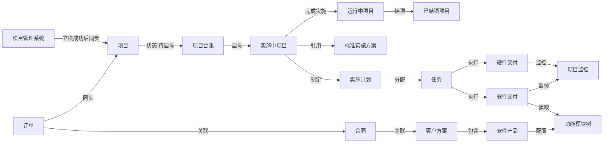

# 项目实施管理 PRD v1.1

## 文档信息

| 项目 | 内容 |
|------|------|
| 产品名称 | 项目实施管理 |
| 文档版本 | v1.1 |
| 编写人 | 产品团队 |
| 创建日期 | 2025-11-17 |
| 最后更新 | 2025-11-29 |
| 状态 | 进行中 |

## 1. 文档版本记录

| 版本号 | 日期 | 修订人 | 修订说明 | 审核人 | 状态 |
|--------|------|--------|----------|--------|------|
| V1.0 | 2025-11-17 | 产品团队 | 初版草稿 |  | 草稿 |
| V1.1 | 2025-11-29 | 龚向飞、陈晨、高晨阳、张伟 | 设计初评：重构项目状态定义，移除立项审批流程，新增待启动、实施中、运行中、已结项状态 |  | 进行中 |

## 2. 功能目标与核心价值

### 2.1 功能目标

项目实施管理模块旨在为项目团队、实施团队、管理层提供统一的项目实施管理平台。通过建立完整的项目实施管理体系，实现从项目立项、计划管控、任务分工、交付执行到项目监控的全流程管理，为项目实施提供标准化、可视化的管理工具，提升项目实施效率和质量。

**主要目标：**
- 建立统一的项目实施管理体系，实现项目全生命周期管理
- 支持项目立项审批，规范项目启动流程
- 实现项目实施计划的可视化管理（甘特图、任务看板）
- 支持标准实施方案的引用，提升实施效率
- 实现软件和硬件交付任务的标准化执行
- 建立项目上线后的监控体系，实时掌握项目运行状态
- 为项目决策和资源调配提供数据支撑

### 2.2 菜单导航结构

项目实施模块采用一级菜单下的多个独立二级菜单页面结构：

**一级菜单：项目实施**

**二级菜单：**
1. **项目台账**：项目列表管理 + 项目详情页（基本信息、实施计划）
2. **任务执行**：任务列表（列表/看板视图） + 任务详情页（软件交付/硬件交付）
3. **项目监控**：项目监控页面（选择项目查看运行状态）
4. **标准实施方案**：标准实施方案模板库管理

**页面关系说明：**
- 项目台账：管理项目基本信息、实施计划
- 任务执行：独立的任务管理中心，支持跨项目查看和按用户、状态筛选
- 项目监控：独立的监控中心，支持项目切换和多维度数据展示
- 标准实施方案：独立的模板库，支持版本管理和复用

### 2.3 核心价值

**对客户：**
- 获得更加规范和高效的项目实施服务
- 实时了解项目实施进度和交付状态
- 享受连贯一致的服务体验

**对公司：**
- 建立完整的项目实施信息库，避免信息孤岛
- 提升项目实施管理的标准化和规范化水平
- 支撑项目资源的精准调配和进度管控
- 便于项目风险识别和问题及时处理
- 为项目决策和绩效考核提供数据支持

**对集团：**
- 形成统一的项目实施管理标准
- 支撑项目资源的整合与共享

## 3. 业务背景与使用场景

### 3.1 背景说明

随着公司业务规模的不断扩大，项目实施管理面临以下挑战：
- 项目立项流程不规范，缺乏统一的审批机制
- 项目实施计划管理分散，进度跟踪困难
- 任务分工不明确，责任人职责不清
- 软件和硬件交付任务缺乏标准化流程
- 项目上线后缺乏有效的监控手段
- 项目数据分散，难以形成完整的项目视图
- 缺乏标准实施方案库，重复工作多

为解决上述问题，需建设统一的项目实施管理模块，实现项目立项、计划管控、任务分工、交付执行、项目监控的全流程标准化管理。

### 3.2 使用场景

| 场景编号 | 场景名称 | 场景说明 | 典型用户 |
|---------|---------|----------|---------|
| S01 | 项目同步 | 从项目管理系统同步已立项项目到OMS项目台账 | 系统自动 |
| S02 | 计划制定 | 引用标准实施方案或自定义实施计划，制定项目时间表 | 项目经理 |
| S03 | 任务分配 | 将实施任务分配给具体责任人，设置任务时间节点 | 项目经理 |
| S04 | 进度跟踪 | 通过甘特图和任务看板跟踪项目进度，更新任务状态 | 项目经理、实施人员 |
| S05 | 软件交付 | 执行软件产品账户开通、模块启用等交付任务 | 实施人员、技术支持 |
| S06 | 硬件交付 | 执行硬件发货、验收、安装调试等交付任务 | 实施人员、物流人员 |
| S07 | 项目监控 | 监控项目上线后的模块使用情况、活跃度、异常情况 | 项目经理、运维人员 |
| S08 | 项目查询 | 根据订单、状态、负责人等条件快速查找项目 | 所有用户 |

## 4. 用户角色与职责

| 角色 | 职责 | 权限范围 |
|------|------|----------|
| 项目经理 | 创建项目、制定计划、分配任务、跟踪进度、提交审批 | 创建、编辑自己负责的项目 |
| 实施人员 | 执行交付任务、更新任务进度、记录实施过程 | 查看、编辑自己负责的任务 |
| 技术支持 | 执行软件交付任务、配置模块、开通账户 | 查看、编辑软件交付相关任务 |
| 物流人员 | 执行硬件发货、验收、安装等任务 | 查看、编辑硬件交付相关任务 |
| 项目总监 | 审核立项申请、监控项目进度、资源调配 | 查看、审核本部门所有项目 |
| 管理层 | 查看项目整体情况、项目分析决策 | 查看所有项目 |
| 管理员 | 系统配置、标准方案管理、权限管理 | 超级权限 |

## 5. 业务流程

### 5.1 业务流程图

```
┌─────────────────────────────────────────────────────────────┐
│                    项目实施管理流程                          │
└─────────────────────────────────────────────────────────────┘

开始
 │
 ├──► 从项目管理系统同步项目
 │    ├─► 项目已在项目管理系统中立项成功
 │    ├─► 同步到OMS项目台账
 │    ├─► 项目初始状态为"待启动"
 │    └─► 自动填充项目基本信息
 │
 ├──► 启动项目
 │    ├─► 项目状态变更为"实施中"
 │    ├─► 记录实际开始日期
 │    └─► 开始制定实施计划
 │
 ├──► 制定实施计划
 │    ├─► 引用标准实施方案（可选）
 │    ├─► 自定义实施计划
 │    ├─► 设置任务时间节点
 │    ├─► 分配任务责任人
 │    └─► 生成甘特图
 │
 ├──► 执行实施任务
 │    ├─► 软件交付任务
 │    │   ├─► 软件产品账户开通（项目纳管）
 │    │   ├─► 管理员账号创建
 │    │   └─► 模块启用配置（从客户方案读取）
 │    │
 │    └─► 硬件交付任务
 │        ├─► 硬件发货（从客户方案读取）
 │        ├─► 到货验收
 │        ├─► 安装调试
 │        └─► 安装完成确认
 │
 ├──► 完成实施
 │    ├─► 所有实施任务已完成
 │    ├─► 项目进度达到100%
 │    ├─► 项目状态变更为"运行中"
 │    └─► 启动项目监控
 │
 ├──► 项目监控
 │    ├─► 监控模块使用情况
 │    ├─► 统计活跃度（PV、UV）
 │    └─► 异常监测和预警
 │
 ├──► 项目结项
 │    ├─► 项目运行稳定
 │    ├─► 客户验收通过（可选）
 │    ├─► 项目状态变更为"已结项"
 │    └─► 记录结项日期
 │
 └──► 结束
```

### 5.2 系统流程（泳道图）

```
┌─────────────────────────────────────────────────────────────────────────┐
│                          项目实施系统流程图                                │
└─────────────────────────────────────────────────────────────────────────┘

项目经理        │  启动项目  →  制定实施计划  →  分配任务
                │                                                         │
────────────────┼─────────────────────────────────────────────────────────┼
                │                                                ↓
项目总监        │                                       监控项目进度
                │                                                         │
────────────────┼─────────────────────────────────────────────────────────┼
                │                                                ↓
系统            │  同步项目  →  生成项目编号  →  更新项目状态
                │                                                         │
────────────────┼─────────────────────────────────────────────────────────┼
                │                                                ↓
实施人员        │  执行任务  →  更新进度  →  完成交付任务  →  记录实施过程
                │                                                         │
────────────────┼─────────────────────────────────────────────────────────┼
                │                                                ↓
系统            │  采集监控数据  →  统计分析  →  异常预警  →  生成监控报告
```

### 5.3 业务关联关系



**关键关联链路：**
- 项目 → 订单 → 合同 → 客户方案 → 软件产品 → 功能模块树（用于软件交付的模块启用配置）

## 6. 功能需求说明

### 6.1 页面1：项目列表页

#### 一、页面功能说明

该页面展示所有项目的列表信息，支持多条件查询、筛选、排序、分页等功能。用户可以查看项目基本信息、快速定位目标项目、进行项目的新增、编辑、删除等操作。

#### 二、UI 示意（留图区域）

```
┌───────────────────────────────────────────────────────────────────────────┐
│  页面容器（内边距：24px）                                                  │
│  ┌─────────────────────────────────────────────────────────────────────┐ │
│  │  卡片容器                                                             │ │
│  │  ┌───────────────────────────────────────────────────────────────┐ │ │
│  │  │  标题区 + 主要操作按钮                                           │ │ │
│  │  │  项目实施管理                    [+ 新建项目] [批量导出] [导出] │ │ │
│  │  └───────────────────────────────────────────────────────────────┘ │ │
│  │  ┌───────────────────────────────────────────────────────────────┐ │ │
│  │  │  搜索筛选区                                                      │ │ │
│  │  │  ┌──────────────────┐ ┌──────────┐ ┌──────────┐ ┌──────────┐ │ │ │
│  │  │  │关键字(名称/编号)│ │关联订单  │ │项目状态  │ │负责人    │ │ │ │
│  │  │  └──────────────────┘ └──────────┘ └──────────┘ └──────────┘ │ │ │
│  │  │  ┌──────────┐ ┌──────────┐                                       │ │ │
│  │  │  │创建日期  │ │客户名称  │              [搜索] [重置]           │ │ │
│  │  │  └──────────┘ └──────────┘                                       │ │ │
│  │  └───────────────────────────────────────────────────────────────┘ │ │
│  │  ┌───────────────────────────────────────────────────────────────┐ │ │
│  │  │  数据表格区                                                      │ │ │
│  │  │  □ 项目编号↑│项目名称│客户│订单│状态│进度│负责人│创建时间│操作│ │ │
│  │  │  ├───────────────────────────────────────────────────────────┤ │ │
│  │  │  │ □ XM-001  │XX项目 │XX科技│DD-001│实施中│60%│张三│2024-10-20│查看 编辑│ │ │
│  │  │  │ □ XM-002  │YY项目 │YY集团│DD-002│待启动│0%│李四│2024-11-01│查看 编辑│ │ │
│  │  │  │ □ XM-003  │ZZ项目 │ZZ企业│DD-003│已完成│100%│王五│2024-09-10│查看    │ │ │
│  │  │  │ ...       │       │      │      │      │   │    │          │          │ │ │
│  │  │  ├───────────────────────────────────────────────────────────┤ │ │
│  │  │  │ 共 50 条  [1] 2 3 4 5                         每页20条 ▼   │ │ │
│  │  │  └───────────────────────────────────────────────────────────┘ │ │
│  │  └───────────────────────────────────────────────────────────────┘ │ │
│  └─────────────────────────────────────────────────────────────────────┘ │
└───────────────────────────────────────────────────────────────────────────┘

【新建项目弹框】
┌────────────────────────────────────────────┐
│  新建项目                              [×]   │
├────────────────────────────────────────────┤
│  项目名称（必填）：                          │
│  ┌────────────────────────────────────┐    │
│  │ 请输入项目名称                        │    │
│  └────────────────────────────────────┘    │
│                                            │
│  关联订单（必填）：                          │
│  ┌────────────────────────────────────┐    │
│  │ 请选择订单 ▼                         │    │
│  └────────────────────────────────────┘    │
│                                            │
│  项目负责人（必填）：                        │
│  ┌────────────────────────────────────┐    │
│  │ 请选择负责人 ▼                       │    │
│  └────────────────────────────────────┘    │
├────────────────────────────────────────────┤
│                    [取消]     [确定]       │
└────────────────────────────────────────────┘
```

📎【此处插入详细原型图】

#### 三、功能点说明

**页面布局：**
- 页面内边距：24px
- 采用卡片容器布局，包含标题区、搜索筛选区、数据表格区
- 标题区：页面标题（左侧）+ 主要操作按钮（右侧，右对齐）
- 搜索筛选区：搜索条件横向排列，自动换行；搜索按钮和重置按钮位于搜索条件右侧，右对齐
- 搜索区与表格区之间间距：16px

**搜索功能：**
- 支持按关键字（项目名称或编号）、关联订单、项目状态、负责人、创建日期、客户名称等条件搜索
- 关键字搜索提示文字："项目名称或编号"，支持模糊匹配，同时匹配项目名称和项目编号
- 关键字搜索支持回车键快速搜索，支持清空按钮
- 下拉选择（项目状态、负责人等）支持多选功能，可同时选择多个选项进行筛选
- 下拉选择提供"全部"或"请选择"选项，支持清空
- 日期范围选择器宽度：240px，格式：YYYY-MM-DD
- 搜索按钮：主要按钮样式，带搜索图标
- 重置按钮：次要按钮样式，清空所有搜索条件并刷新数据

**表格设计：**
- 列表每行前含复选框，支持批量选择和批量导出
- 批量导出按钮在左上角，选中数据后才可用，未选中时禁用状态
- 导出按钮在右上角靠右显示，与其他列表页保持一致
- **列名对齐**：所有列名（表头）统一居中对齐显示
- **编号列**：项目编号，文字链接样式（主题色），点击跳转详情页，数据居中对齐
- **名称列**：项目名称，数据居中对齐
- **状态列**：项目状态，使用标签（Tag）展示，数据居中对齐，宽度100px
- **数值列**：项目进度，数据右对齐，以百分比显示
- **文字列**：客户名称、负责人等，数据左对齐，超出部分显示...，悬停后用tooltip显示全部内容
- **操作列**：位置在表格最右侧，固定列，数据左对齐，宽度200-240px，操作项为文字链接样式，小号按钮
  - 列表页只显示"编辑"和"删除"按钮，状态流转操作（启动、完成实施、暂停、恢复、结项、取消）在详情页进行
  - 编辑按钮：待启动、实施中状态的项目显示
  - 删除按钮：仅待启动状态的项目显示
- 支持排序的字段：项目编号、项目名称、客户名称、关联订单、项目状态、项目进度、负责人、创建时间
- 不支持排序的字段：操作列
- 分页功能：位置在表格底部，显示格式"共 X 条"，每页选项：10、20、50、100条
- 表格区域高度自适应页面高度，确保整个页面不出现纵向滚动条
- 当数据行数较多时，表格内容区域出现纵向滚动条，表头固定，分页控件始终固定在表格底部
- 加载状态：表格区域显示加载动画，数据加载、搜索、分页切换时显示

**状态标识：**
- 项目状态采用颜色标签展示，遵循状态颜色规范：
  - 待启动：灰色（default）
  - 实施中：蓝色（processing）
  - 运行中：蓝色（blue）
  - 已暂停：橙色（warning）
  - 已结项：绿色（success）
  - 已取消：红色（error）
- 项目进度以百分比显示，支持进度条可视化

**其他功能：**
- 点击项目编号可进入详情页
- 新建项目支持从订单快速创建，自动填充订单相关信息
- 一个订单可以创建多个项目

#### 四、关键操作流程

**新建项目流程：**
1. 用户点击"新建项目"按钮
2. 弹出新建对话框
3. 用户填写项目名称（必填）及其他必填字段
4. 选择关联订单（必填），系统自动填充客户信息
5. 选择项目负责人（必填）
6. 点击"确定"按钮，验证表单
7. 系统自动生成项目编号
8. 跳转到详情页（编辑模式），继续完善信息

**查看流程：**
1. 用户在列表页点击项目编号
2. 跳转到详情页（查看模式）
3. 展示完整信息

**编辑流程：**
1. 用户在列表页点击"编辑"按钮
2. 跳转到详情页（编辑模式）
3. 用户修改信息
4. 点击"保存"按钮，系统保存修改

**删除流程：**
1. 用户点击"删除"按钮
2. 弹出确认对话框："确定要删除"XXX项目"吗？"
3. 系统校验是否已有实施记录
4. 如已有实施记录，提示"该项目已有实施记录，无法删除"，禁止删除
5. 如无实施记录，执行删除操作
6. 刷新列表页，显示成功提示

#### 五、业务规则

- 项目名称必填且不能重复
- 项目编号自动生成，格式：XM-YYYYMMDD-XXX（XM=项目拼音首字母）
- 项目必须关联订单，一个订单可以创建多个项目
- 删除项目需校验是否已有实施记录
- 批量删除时，逐个校验每条数据是否可删除
- 批量删除按钮在未选中数据时为禁用状态
- 列表默认按创建时间降序排列
- 项目状态可选：待启动、实施中、运行中、已暂停、已结项、已取消
- 项目进度范围0-100%，自动计算或手动更新

#### 六、字段定义

| 字段名称 | 类型 | 是否必填 | 长度/精度 | 说明 |
|----------|------|----------|-----------|------|
| 项目编号 | 字符串 | 是 | 长度20 | 系统自动生成，格式：XM-YYYYMMDD-XXX |
| 项目名称 | 字符串 | 是 | 长度100 | 项目名称 |
| 关联订单ID | 整数 | 是 | - | 关联订单ID |
| 关联订单编号 | 字符串 | 是 | 长度20 | 订单编号，可点击跳转 |
| 客户ID | 整数 | 是 | - | 关联客户ID |
| 客户名称 | 字符串 | 是 | 长度100 | 客户名称 |
| 项目状态 | 枚举 | 是 | - | 待启动/实施中/运行中/已暂停/已结项/已取消 |
| 项目进度 | 数值 | 否 | 精度0 | 项目进度百分比(0-100) |
| 项目负责人 | 字符串 | 是 | 长度30 | 项目负责人姓名 |
| 计划开始日期 | 日期 | 否 | - | 计划开始日期 |
| 计划完成日期 | 日期 | 否 | - | 计划完成日期 |
| 实际开始日期 | 日期 | 否 | - | 实际开始日期 |
| 实际完成日期 | 日期 | 否 | - | 实际完成日期 |
| 创建人 | 字符串 | 是 | 长度30 | 创建人姓名 |
| 创建时间 | 日期时间 | 是 | - | 创建时间 |
| 更新时间 | 日期时间 | 否 | - | 最近修改时间 |

### 6.2 页面2：项目台账详情页

#### 一、页面功能说明

展示单个项目的完整信息，包括基本信息、实施计划等。支持查看、编辑、启动项目、完成实施、结项、更新进度等操作。该页面属于项目台账模块的详情页，主要管理项目的基础信息和计划信息。项目的立项和审批在项目管理系统中管理，立项成功后同步到OMS项目台账中。

#### 二、UI 示意（留图区域）

```
┌───────────────────────────────────────────────────────────────────────────────┐
│  页面容器（内边距：16px）                                                      │
│  ┌─────────────────────────────────────────────────────────────────────────┐ │
│  │  页面头部                                                                 │ │
│  │  ← 返回  XX项目实施项目                    [编辑] [删除] │ │
│  │  项目编号：XM-20241020-001  [实施中]  进度：60%                           │ │
│  └─────────────────────────────────────────────────────────────────────────┘ │
│  ┌─────────────────────────────────────────────────────────────────────────┐ │
│  │  统计信息卡片                                                             │ │
│  │  项目进度    任务总数    已完成     进行中     待办     关联订单   客户   │ │
│  │   60%        20个        12个       5个        3个       DD-001    XX科技│ │
│  └─────────────────────────────────────────────────────────────────────────┘ │
│  ┌─────────────────────────────────────────────────────────────────────────┐ │
│  │  标签页容器                                                               │ │
│  │  [基本信息] [实施计划]                                                    │ │
│  │  ┌───────────────────────────────────────────────────────────────────┐ │ │
│  │  │  基本信息（卡片：表单/信息展示）                                   │ │ │
│  │  │  ┌───────────────────────┐  ┌────────────────────────┐         │ │ │
│  │  │  │ 项目编号：             │  │ 项目名称：              │         │ │ │
│  │  │  │ XM-20241020-001       │  │ XX项目实施项目          │         │ │ │
│  │  │  └───────────────────────┘  └────────────────────────┘         │ │ │
│  │  │  ┌───────────────────────┐  ┌────────────────────────┐         │ │ │
│  │  │  │ 关联订单：             │  │ 客户名称：              │         │ │ │
│  │  │  │ DD-20241020-001 →      │  │ XX科技有限公司 →        │         │ │ │
│  │  │  └───────────────────────┘  └────────────────────────┘         │ │ │
│  │  │  ┌───────────────────────┐  ┌────────────────────────┐         │ │ │
│  │  │  │ 项目状态：             │  │ 项目进度：              │         │ │ │
│  │  │  │ 实施中 ▼               │  │ 60%                     │         │ │ │
│  │  │  └───────────────────────┘  └────────────────────────┘         │ │ │
│  │  │  ┌───────────────────────┐  ┌────────────────────────┐         │ │ │
│  │  │  │ 项目负责人：           │  │ 计划开始日期：            │         │ │ │
│  │  │  │ 张三 ▼                 │  │ 2024-10-25              │         │ │ │
│  │  │  └───────────────────────┘  └────────────────────────┘         │ │ │
│  │  │  ┌───────────────────────┐  ┌────────────────────────┐         │ │ │
│  │  │  │ 计划完成日期：         │  │ 实际开始日期：          │         │ │ │
│  │  │  │ 2025-04-25             │  │ 2024-10-25              │         │ │ │
│  │  │  └───────────────────────┘  └────────────────────────┘         │ │ │
│  │  │  ┌─────────────────────────────────────────────────────────┐   │ │ │
│  │  │  │ 项目描述：                                               │   │ │ │
│  │  │  │ 本项目包含软件开发、硬件采购、实施服务...                │   │ │ │
│  │  │  └─────────────────────────────────────────────────────────┘   │ │ │
│  │  │                                                    [保存] [取消]│ │ │
│  │  └───────────────────────────────────────────────────────────────────┘ │ │
│  └─────────────────────────────────────────────────────────────────────────┘ │
└───────────────────────────────────────────────────────────────────────────────┘
```

📎【此处插入详细原型图】

#### 三、功能点说明

**页面布局：**
- 页面内边距：16px
- 页面头部：返回按钮（左侧）+ 标题信息（页面标题、编号、状态标签）+ 操作按钮组（右侧）
- 统计信息卡片：横向排列多个统计项，大号数字 + 小号标签，不同数据使用不同颜色区分
- 标签页区域：使用标签页将相关信息分组，每个标签页内使用卡片分组展示
- 表单布局：多列布局，充分利用页面宽度，相关字段横向排列，每行2-3个字段，统一标签宽度，保持对齐
- 表单项之间垂直间距：24px
- 按钮组内按钮间距：8px
- 卡片间距：16px

**功能说明：**
- 页面顶部显示项目名称、编号、状态、进度
- 顶部统计区域显示关键业务指标（项目进度、任务统计、关联信息）
- 详情分为2个标签页（基本信息、实施计划）
- 保存/取消按钮放在基本信息表单右下方（编辑模式）
- 编辑按钮在查看模式下显示，点击后切换到编辑模式
- 删除按钮仅在待启动状态且无实施记录时可用
- 审批记录标签页已移除（项目的立项和审批在项目管理系统中管理）

#### 四、关键操作流程

**查看详情流程：**
1. 用户在列表页点击项目编号
2. 跳转到详情页（查看模式）
3. 显示完整信息、统计数据
4. 可切换标签页查看不同信息
5. 可点击"编辑"切换到编辑模式

**编辑流程：**
1. 用户在详情页点击"编辑"按钮
2. 页面切换到编辑模式（表单可编辑）
3. 用户修改信息
4. 点击"保存"按钮，系统验证表单
5. 保存成功后，页面切换到查看模式，显示成功提示
6. 如点击"取消"，则放弃修改，恢复到查看模式

**启动项目流程：**
1. 用户在详情页点击"启动"按钮
2. 系统校验项目信息完整性（项目名称、负责人、计划开始日期等）
3. 如校验不通过，提示错误信息；如校验通过，弹出确认对话框
4. 用户确认后，项目状态更新为"实施中"
5. 系统自动记录实际开始日期

**完成实施流程：**
1. 用户在详情页点击"完成实施"按钮
2. 系统校验所有实施任务是否已完成，项目进度是否达到100%
3. 如校验不通过，提示错误信息；如校验通过，弹出确认对话框
4. 用户确认后，项目状态更新为"运行中"
5. 系统自动记录实施完成日期

**暂停项目流程：**
1. 用户在详情页点击"暂停项目"按钮
2. 弹出确认对话框，要求填写暂停原因（必填）
3. 用户填写暂停原因并确认后，项目状态更新为"已暂停"
4. 系统记录暂停原因和时间

**恢复项目流程：**
1. 用户在详情页点击"恢复"按钮
2. 弹出确认对话框，可选填写恢复说明
3. 用户确认后，项目状态恢复到暂停前的状态（实施中或运行中）
4. 系统记录恢复时间和说明

**项目结项流程：**
1. 用户在详情页点击"结项"按钮
2. 弹出确认对话框，可选填写结项说明
3. 用户确认后，项目状态更新为"已结项"
4. 系统自动记录结项日期

**取消项目流程：**
1. 用户在详情页点击"取消项目"按钮
2. 弹出确认对话框，要求填写取消原因（必填）
3. 用户填写取消原因并确认后，项目状态更新为"已取消"
4. 系统记录取消原因和时间

#### 五、业务规则

- 项目编号不可修改，自动生成
- 项目名称必填且不能与其他项目重复
- 项目必须关联订单
- 项目负责人为必填项，从员工列表中选择
- 计划完成日期不能早于计划开始日期
- 已有实施记录的项目不可删除
- 编辑模式下才显示保存/取消按钮
- 查看模式下表单字段只读
- 待启动状态的项目可以启动，启动后进入实施中状态
- 状态流转操作（启动、完成实施、暂停、恢复、结项、取消）仅在详情页进行，列表页只显示编辑和删除按钮
- 暂停和取消操作需要填写原因说明（必填），恢复和结项操作可选填写说明
- 启动项目需校验基本信息完整性（项目名称、负责人、计划开始日期）
- 完成实施需校验所有实施任务已完成且项目进度达到100%

#### 六、字段定义

| 字段名称 | 类型 | 是否必填 | 长度/精度 | 说明 |
|----------|------|----------|-----------|------|
| 项目编号 | 字符串 | 是 | 长度20 | 唯一标识，自动生成 |
| 项目名称 | 字符串 | 是 | 长度100 | 项目名称 |
| 关联订单ID | 整数 | 是 | - | 关联订单ID |
| 关联订单编号 | 字符串 | 是 | 长度20 | 订单编号，可点击跳转 |
| 客户ID | 整数 | 是 | - | 关联客户ID |
| 客户名称 | 字符串 | 是 | 长度100 | 客户名称 |
| 项目状态 | 枚举 | 是 | - | 待启动/实施中/运行中/已暂停/已结项/已取消 |
| 项目进度 | 数值 | 否 | 精度0 | 项目进度百分比(0-100) |
| 项目负责人 | 字符串 | 是 | 长度30 | 项目负责人，从员工列表选择 |
| 计划开始日期 | 日期 | 否 | - | 计划开始日期 |
| 计划完成日期 | 日期 | 否 | - | 计划完成日期 |
| 实际开始日期 | 日期 | 否 | - | 实际开始日期 |
| 实际完成日期 | 日期 | 否 | - | 实际完成日期 |
| 项目描述 | 文本 | 否 | 长度500 | 项目描述信息 |
| 创建人 | 字符串 | 是 | 长度30 | 创建人姓名 |
| 创建时间 | 日期时间 | 是 | - | 创建时间 |
| 更新人 | 字符串 | 否 | 长度30 | 最后更新人 |
| 更新时间 | 日期时间 | 否 | - | 最后更新时间 |

### 6.3 页面3：实施计划标签页（项目台账详情页）

#### 一、页面功能说明

该标签页用于管理项目的实施计划，支持引用标准实施方案或自定义计划，支持甘特图视图和列表视图切换，展示任务时间线和依赖关系，支持任务的新增、编辑、删除、拖拽调整等操作。

#### 二、UI 示意（留图区域）

```
┌─────────────────────────────────────────────────────────────────────────┐
│  [基本信息] [实施计划] [审批记录]                                        │
├─────────────────────────────────────────────────────────────────────────┤
│  [+ 添加任务] [甘特图视图] [列表视图]                                    │
├─────────────────────────────────────────────────────────────────────────┤
│                                                                           │
│  视图切换：当前显示 [甘特图视图]                                         │
│                                                                           │
│  甘特图视图                                                               │
│  ┌───────────────────────────────────────────────────────────────────┐ │
│  │ 甘特图工具栏：[时间视图：日 周 月] [全屏]                          │ │
│  ├───────────────────────────────────────────────────────────────────┤ │
│  │ 任务名称          │ 2024-10 │ 2024-11 │ 2024-12 │ 2025-01 │ 2025-02│ │
│  ├──────────────────┼─────────┼─────────┼─────────┼─────────┼────────┤ │
│  │ 📋 需求分析       │ ████████│         │         │         │        │ │
│  │ 📋 系统设计       │         │ ████████│ ████    │         │        │ │
│  │ 📋 开发实施       │         │         │ ████████│ ████████│ ████   │ │
│  │ 📋 系统测试       │         │         │         │         │ ██████ │ │
│  │ 📋 上线部署       │         │         │         │         │ ████   │ │
│  │ 📋 验收培训       │         │         │         │         │ ████   │ │
│  └──────────────────┴─────────┴─────────┴─────────┴─────────┴────────┘ │
│                                                                           │
│  列表视图（表格设计遵循通用设计规范）                                       │
│  ┌───────────────────────────────────────────────────────────────────┐ │
│  │ 任务名称 │ 开始日期 │ 结束日期 │ 负责人 │ 进度 │ 状态 │ 操作     │ │
│  ├───────────────────────────────────────────────────────────────────┤ │
│  │ 需求分析 │2024-10-25│2024-11-05│ 张三  │ 100% │ 完成 │ 编辑 删除│ │
│  │ 系统设计 │2024-11-06│2024-11-20│ 李四  │  80% │ 进行 │ 编辑 删除│ │
│  │ 开发实施 │2024-11-21│2025-02-20│ 王五  │  30% │ 进行 │ 编辑 删除│ │
│  │ 系统测试 │2025-02-21│2025-03-20│ 赵六  │   0% │ 待办 │ 编辑 删除│ │
│  │ 上线部署 │2025-03-21│2025-04-10│ 钱七  │   0% │ 待办 │ 编辑 删除│ │
│  │ 验收培训 │2025-04-11│2025-04-25│ 孙八  │   0% │ 待办 │ 编辑 删除│ │
│  └───────────────────────────────────────────────────────────────────┘ │
│  说明：列名居中对齐；任务名称居中对齐；日期居中对齐；负责人左对齐；│ │
│  进度（数值列）右对齐；状态（标签）居中对齐；操作列左对齐              │ │
└─────────────────────────────────────────────────────────────────────────┘
```

📎【此处插入详细原型图】

#### 三、功能点说明

**视图切换：**
- 支持甘特图视图和列表视图切换
- 视图切换按钮位于操作栏右侧
- 切换视图时保持当前筛选和排序状态
- 两种视图数据同步，修改一处自动更新另一处

**甘特图工具栏：**
- 工具栏位于甘特图顶部
- 时间视图切换按钮（日/周/月）靠右对齐，位于全屏按钮左侧
- 全屏按钮位于工具栏最右侧
- 全屏模式下，工具栏左侧显示"添加任务"按钮，右侧为时间视图切换和全屏按钮
- 非全屏模式下，工具栏仅显示时间视图切换和全屏按钮，"添加任务"按钮位于页面操作栏

**甘特图视图：**
- 以时间轴形式展示所有任务的时间线
- 支持时间范围缩放（月视图、周视图、日视图）
- 任务条显示任务名称、时间范围、进度
- 支持任务依赖关系连线（二期规划）
- 支持里程碑标记
- 支持拖拽调整任务时间
- 支持树形结构展示，父任务和子任务以层级关系显示
- 父任务默认展开，可点击展开/收起查看子任务
- 支持任务选中功能：点击任务条可选中任务，选中后任务条和表格行显示高亮（黄色）
- 点击空白区域可取消选中任务，选中状态和视觉高亮同时清除
- 选中任务后点击"添加任务"按钮，系统会根据选中任务自动设置父任务字段
- 支持任务操作功能：
  - 选中任务后，在任务条右侧显示操作按钮
  - 父任务显示"添加子任务"和"删除任务"按钮
  - 子任务只显示"删除任务"按钮
  - 点击"添加子任务"按钮，弹出添加任务对话框，父任务字段自动填充
  - 点击"删除任务"按钮，弹出确认对话框，删除父任务时会提示并递归删除所有子任务

**标准方案引用（二期规划）：**
- 点击"引用标准方案"按钮，弹出方案选择对话框
- 展示标准实施方案库列表
- 支持预览方案详情（任务列表、时间安排）
- 选择方案后，自动创建对应的任务计划
- 可在此基础上进行自定义调整

**任务管理：**
- 支持添加、编辑、删除任务
- 任务字段包括：任务名称、开始日期、结束日期、负责人、进度、状态
- 支持设置任务依赖关系（二期规划）
- 任务状态：待办、进行中、已完成
- 任务进度范围0-100%

**任务层级管理：**
- 任务支持两层结构：父任务和子任务
- 子任务不允许再有子任务（最多两层）
- 父任务的进度自动根据子任务进度计算（子任务进度的平均值）
- 父任务的开始日期自动取子任务中最早的开始日期
- 父任务的结束日期自动取子任务中最晚的结束日期
- 支持在父任务上点击"添加子任务"按钮快速创建子任务
- 任务表格支持树形展示，可展开/收起查看子任务
- 删除父任务时会提示并同时删除所有子任务

**甘特图全屏功能：**
- 甘特图工具栏右侧有全屏/退出全屏按钮
- 点击全屏按钮后，甘特图以全屏模式覆盖整个浏览器窗口
- 全屏模式下保持所有甘特图功能（时间视图切换、任务双击查看等）
- 全屏模式下，工具栏左侧显示"添加任务"按钮，点击后弹出添加任务对话框
- 全屏模式下的添加任务逻辑与非全屏模式一致，都会根据甘特图中选中的任务自动设置父任务
- 可通过全屏按钮或按ESC键退出全屏
- 全屏/退出全屏时甘特图自动调整大小和重新渲染

**任务列表表格设计（遵循通用设计规范）：**
- **列名对齐**：所有列名（表头）统一居中对齐显示
- **名称列**：任务名称，数据居中对齐
- **日期列**：开始日期、结束日期，数据居中对齐
- **文字列**：负责人，数据左对齐
- **数值列**：任务进度，数据右对齐，以百分比显示
- **状态列**：任务状态，使用标签（Tag）展示，数据居中对齐，宽度100px
  - 待办：灰色（default）
  - 进行中：蓝色（processing）
  - 已完成：绿色（success）
- **操作列**：位置在表格最右侧，固定列，数据左对齐，宽度200-240px，操作项为文字链接样式，小号按钮

**交互功能：**
- 甘特图支持拖拽调整任务时间
- 任务列表支持排序和筛选
- 支持导出实施计划（PDF、Excel）

#### 四、关键操作流程

**引用标准方案流程：**
1. 用户点击"引用标准方案"按钮
2. 弹出标准方案选择对话框
3. 用户浏览方案列表，可预览方案详情
4. 选择方案后，系统自动创建对应的任务计划
5. 任务自动填充到甘特图和任务列表
6. 用户可在基础上进行自定义调整

**添加任务流程：**
1. 用户点击"添加任务"按钮（工具栏或全屏模式下的添加任务按钮）
2. 弹出任务编辑对话框
3. 系统根据甘特图中的选中任务自动设置父任务：
   - 如果甘特图中选中了父任务：父任务字段自动选中该父任务，用户可以重新选择或清空
   - 如果甘特图中选中了子任务：父任务字段自动选中该子任务的父任务，用户可以重新选择或清空
   - 如果甘特图中没有选中任务：父任务字段为空
   - 仅在甘特图视图模式下生效，列表视图模式下父任务为空
4. 用户填写任务信息：
   - 任务名称（必填）
   - 父任务（可选，已根据选中任务自动填充，用户可修改）
   - 开始日期（必填）
   - 结束日期（必填）
   - 负责人（必填）
   - 任务描述（可选）
5. 点击"确定"按钮，系统验证表单
6. 保存成功后，任务添加到甘特图和任务列表
7. 如果是子任务，系统自动更新父任务的进度和日期范围

**添加子任务流程：**
1. 用户在任务列表中点击父任务的"添加子任务"按钮
2. 弹出任务编辑对话框，父任务字段自动填充且不可编辑
3. 用户填写子任务信息（任务名称、日期、负责人等）
4. 点击"确定"按钮，系统验证表单
5. 保存成功后，子任务添加到父任务下
6. 系统自动重新计算父任务的进度和日期范围

**删除任务流程：**
1. 用户可以通过以下方式删除任务：
   - 在任务列表中点击任务的"删除"操作按钮
   - 在甘特图中选中任务后，点击任务条右侧的"删除任务"按钮（×）
2. 系统检查任务是否有子任务：
   - 如果是父任务，弹出确认对话框："该任务包含X个子任务，删除后子任务也会被删除。确定要删除任务"XXX"吗？"
   - 如果是普通任务或子任务，弹出确认对话框："确定要删除任务"XXX"吗？"
3. 用户确认后，系统执行删除操作：
   - 如果是父任务，先递归删除所有子任务，再删除父任务
   - 如果是普通任务或子任务，直接删除
4. 删除成功后，更新任务列表和甘特图
5. 如果删除的是当前选中的任务，清空选中状态

**调整任务时间流程：**
1. 双击甘特图中任务条，或点击任务列表中的编辑操作项，在弹框中调整时间
2. 保存后更新任务列表和甘特图

#### 五、业务规则

- 任务名称必填
- 任务开始日期不能晚于结束日期
- 任务时间不能超出项目计划时间范围
- 设置前置任务后，当前任务开始日期不能早于前置任务结束日期（二期规划）
- 删除任务前需检查是否有后续依赖任务（二期规划）
- **任务层级规则：**
  - 任务最多支持两层结构（父任务和子任务）
  - 子任务不能再创建子任务（系统自动校验）
  - 父任务的开始/结束日期、进度为只读（自动计算）
  - 子任务的日期范围建议在父任务的日期范围内
  - 创建子任务时自动关联到父任务
  - 删除父任务时，系统提示并同时删除所有子任务（递归删除）
- **删除任务规则：**
  - 删除父任务前必须弹出确认框，明确提示将同时删除所有子任务
  - 删除父任务时，系统自动递归删除所有子任务
  - 甘特图中支持通过选中任务后的操作按钮删除任务
  - 删除任务后自动更新任务列表和甘特图
- 任务进度自动根据子任务进度计算（如有子任务）
- 标准方案引用后，可进行自定义修改（二期规划）
- 甘特图时间范围自动适配项目时间范围

#### 六、字段定义

| 字段名称 | 类型 | 是否必填 | 长度/精度 | 说明 |
|----------|------|----------|-----------|------|
| 任务ID | 整数 | 是 | - | 唯一标识，自动生成 |
| 任务名称 | 字符串 | 是 | 长度100 | 任务名称 |
| 父任务ID | 整数 | 否 | - | 父任务ID，关联到任务ID，用于层级关系 |
| 是否父任务 | 布尔 | 否 | - | 是否为父任务（自动计算） |
| 开始日期 | 日期 | 是 | - | 任务开始日期（父任务自动计算） |
| 结束日期 | 日期 | 是 | - | 任务结束日期（父任务自动计算） |
| 负责人 | 字符串 | 是 | 长度30 | 任务负责人 |
| 任务进度 | 数值 | 否 | 精度0 | 任务进度百分比(0-100)，父任务自动计算 |
| 任务状态 | 枚举 | 是 | - | 待办/进行中/已完成 |
| 前置任务ID | 整数 | 否 | - | 前置任务ID，用于依赖关系 |
| 任务描述 | 文本 | 否 | 长度500 | 任务描述信息 |
| 是否里程碑 | 布尔 | 否 | - | 是否为里程碑任务 |
| 创建时间 | 日期时间 | 是 | - | 创建时间 |
| 更新时间 | 日期时间 | 否 | - | 最后更新时间 |

### 6.4 页面4：审批记录标签页（已移除） 

#### 一、页面功能说明

**说明：** 该标签页已移除。项目的立项和审批不在OMS系统中管理，在项目管理系统中立项成功后，同步到OMS项目台账中，初始状态为"待启动"。如需查看审批记录，请在项目管理系统中查看。

#### 二、UI 示意（留图区域）

```
┌─────────────────────────────────────────────────────────────────────────┐
│  [基本信息] [实施计划]                                                  │
├─────────────────────────────────────────────────────────────────────────┤
│                                                                           │
│  说明：审批记录标签页已移除。项目的立项和审批在项目管理系统中管理，    │
│  立项成功后同步到OMS项目台账中，初始状态为"待启动"。                    │
│                                                                           │
└─────────────────────────────────────────────────────────────────────────┘
```

📎【此处插入详细原型图】

#### 三、功能点说明

**说明：** 该标签页已移除。项目的立项和审批在项目管理系统中管理，立项成功后同步到OMS项目台账中，初始状态为"待启动"。如需查看审批记录，请在项目管理系统中查看。

### 6.5 页面5：任务执行页面

#### 一、页面功能说明

该页面是独立的任务管理中心，展示所有项目的任务列表，支持列表视图和看板视图切换。默认显示当前用户待办任务，有权限的用户可以切换查看不同状态、所有其他用户的任务。支持查看任务详情，根据任务类型（软件交付/硬件交付）显示不同的任务详情内容。

#### 二、UI 示意（留图区域）

**任务列表页（列表视图）：**
```
┌───────────────────────────────────────────────────────────────────────────┐
│  页面容器（内边距：24px）                                                  │
│  ┌─────────────────────────────────────────────────────────────────────┐ │
│  │  卡片容器                                                             │ │
│  │  ┌───────────────────────────────────────────────────────────────┐ │ │
│  │  │  标题区 + 主要操作按钮                                           │ │ │
│  │  │  任务执行管理                    [列表视图] [看板视图]        │ │ │
│  │  └───────────────────────────────────────────────────────────────┘ │ │
│  │  ┌───────────────────────────────────────────────────────────────┐ │ │
│  │  │  搜索筛选区                                                      │ │ │
│  │  │  ┌──────────┐ ┌──────────┐ ┌──────────┐                       │ │ │
│  │  │  │项目筛选  │ │任务类型  │ │负责人    │                       │ │ │
│  │  │  └──────────┘ └──────────┘ └──────────┘                       │ │ │
│  │  │  ┌──────────┐ ┌──────────┐                                    │ │ │
│  │  │  │计划时间  │ │关键字    │              [搜索] [重置]           │ │ │
│  │  │  └──────────┘ └──────────┘                                    │ │ │
   │  │  └───────────────────────────────────────────────────────────────┘ │ │
   │  │  ┌───────────────────────────────────────────────────────────────┐ │ │
   │  │  │  状态统计徽标区                                                  │ │ │
   │  │  │  [全部 (50)]  [待办 (10)]  [进行中 (30)]  [已完成 (10)]          │ │ │
   │  │  └───────────────────────────────────────────────────────────────┘ │ │
   │  │  ┌───────────────────────────────────────────────────────────────┐ │ │
   │  │  │  数据表格区                                                      │ │ │
   │  │  │  □ 任务名称│项目│任务类型│状态│负责人│计划时间│进度│操作│      │ │ │
│  │  │  ├───────────────────────────────────────────────────────────┤ │ │
│  │  │  │ □ 账户开通│XX项目│软件交付│进行中│张三│2024-10-25│80%│查看│ │ │
│  │  │  │ □ 硬件发货│YY项目│硬件交付│待办│李四│2024-11-01│0%│查看│ │ │
│  │  │  │ □ 模块启用│XX项目│软件交付│已完成│王五│2024-10-27│100%│查看│ │ │
│  │  │  │ ...       │       │      │      │   │    │          │          │ │ │
│  │  │  ├───────────────────────────────────────────────────────────┤ │ │
│  │  │  │ 共 50 条  [1] 2 3 4 5                         每页20条 ▼   │ │ │
│  │  │  └───────────────────────────────────────────────────────────┘ │ │
│  │  └───────────────────────────────────────────────────────────────┘ │ │
│  └─────────────────────────────────────────────────────────────────────┘ │
└───────────────────────────────────────────────────────────────────────────┘
```

**任务列表页（看板视图）：**
```
┌───────────────────────────────────────────────────────────────────────────┐
│  页面容器（内边距：24px）                                                  │
│  ┌─────────────────────────────────────────────────────────────────────┐ │
│  │  卡片容器                                                             │ │
│  │  ┌───────────────────────────────────────────────────────────────┐ │ │
│  │  │  标题区 + 视图切换                                             │ │ │
│  │  │  任务执行管理                    [列表视图] [看板视图]        │ │ │
│  │  └───────────────────────────────────────────────────────────────┘ │ │
│  │  ┌───────────────────────────────────────────────────────────────┐ │ │
│  │  │  搜索筛选区                                                      │ │ │
│  │  │  ┌──────────┐ ┌──────────┐ ┌──────────┐                      │ │ │
│  │  │  │项目筛选  │ │任务类型  │ │负责人    │                      │ │ │
│  │  │  └──────────┘ └──────────┘ └──────────┘                      │ │ │
│  │  │                                              [搜索] [重置]     │ │ │
│  │  └───────────────────────────────────────────────────────────────┘ │ │
│  │  ┌───────────────────────────────────────────────────────────────┐ │ │
│  │  │  任务看板                                                       │ │ │
│  │  │  ┌──────────────┬──────────────┬──────────────┐               │ │ │
│  │  │  │   待办       │   进行中     │   已完成     │               │ │ │
│  │  │  ├──────────────┼──────────────┼──────────────┤               │ │ │
│  │  │  │              │              │              │               │ │ │
│  │  │  │ [XX项目]     │ [XX项目]     │ [XX项目]     │               │ │ │
│  │  │  │ ┌──────────┐ │ ┌──────────┐ │ ┌──────────┐ │               │ │ │
│  │  │  │ │账户开通  │ │ │模块启用  │ │ │账号创建  │ │               │ │ │
│  │  │  │ │软件交付  │ │ │软件交付  │ │ │软件交付  │ │               │ │ │
│  │  │  │ │张三      │ │ │李四      │ │ │王五      │ │               │ │ │
│  │  │  │ │进度: 0%  │ │ │进度: 80% │ │ │进度:100% │ │               │ │ │
│  │  │  │ └──────────┘ │ └──────────┘ │ └──────────┘ │               │ │ │
│  │  │  │              │              │              │               │ │ │
│  │  │  │ [YY项目]     │              │              │               │ │ │
│  │  │  │ ┌──────────┐ │              │              │               │ │ │
│  │  │  │ │硬件发货  │ │              │              │               │ │ │
│  │  │  │ │硬件交付  │ │              │              │               │ │ │
│  │  │  │ │李四      │ │              │              │               │ │ │
│  │  │  │ │进度: 0%  │ │              │              │               │ │ │
│  │  │  │ └──────────┘ │              │              │               │ │ │
│  │  │  └──────────────┴──────────────┴──────────────┘               │ │ │
│  │  └───────────────────────────────────────────────────────────────┘ │ │
│  └─────────────────────────────────────────────────────────────────────┘ │
└───────────────────────────────────────────────────────────────────────────┘
```

📎【此处插入详细原型图】

#### 三、功能点说明

**页面布局（遵循通用设计规范）：**
- 页面内边距：24px
- 采用卡片容器布局，包含标题区、搜索筛选区、数据展示区
- 标题区：页面标题（左侧）+ 视图切换按钮（右侧）
- 搜索筛选区：搜索条件横向排列，自动换行；搜索按钮和重置按钮位于搜索条件右侧，右对齐
- 搜索区与数据展示区之间间距：16px

**状态统计徽标区（列表视图）：**
- 位于搜索筛选区和数据表格区之间
- 显示各状态的任务数量统计：全部、待办、进行中、已完成
- 样式：文字标签 + 数字徽标（不同状态不同颜色）
- 交互：点击徽标可快速过滤列表数据，点击后徽标显示选中状态
- 默认状态：默认选中"待办"徽标，列表默认显示待办任务

**默认显示规则：**
- 列表视图默认选中"待办"状态徽标
- 列表默认显示当前用户的待办任务
- 项目筛选默认选中全部（当前用户参与的）
- 负责人筛选默认选中当前用户
- 拥有查看所有项目权限的用户可以看到所有项目和所有用户的任务，不需要默认选中项目和负责人；

**列表视图：**
- 展示所有项目的任务列表（支持项目筛选）
- **表格设计**（遵循通用设计规范）：
  - **列名对齐**：所有列名（表头）统一居中对齐显示
  - **名称列**：任务名称，数据居中对齐
  - **文字列**：项目名称、负责人，数据左对齐
  - **枚举列**：任务类型、任务状态，数据居中对齐
  - **状态列**：任务状态，使用标签（Tag）展示，数据居中对齐，宽度100px
    - 待办：灰色（default）
    - 进行中：蓝色（processing）
    - 已完成：绿色（success）
  - **日期列**：计划时间，数据居中对齐
    - 计划开始：显示计划开始日期
    - 计划完成：显示计划完成日期；如果任务状态为未完成（待办或进行中）且计划完成时间已过，显示"超期X天"（X为超出天数，红色标识）
  - **数值列**：任务进度，数据右对齐，以百分比显示
  - **操作列**：位置在表格最右侧，固定列，数据左对齐，宽度200-240px，操作项为文字链接样式，小号按钮
- 支持排序的字段：任务名称、项目名称、任务类型、任务状态、负责人、计划时间、任务进度
- 分页功能：位置在表格底部，显示格式"共 X 条"，每页选项：10、20、50、100条

**看板视图：**
- 按任务状态分为3列：待办、进行中、已完成
- 每列内按项目分组显示任务卡片
- 任务卡片显示：任务名称、任务类型、负责人、进度
- 支持拖拽任务卡片在不同状态列间移动
- 支持点击任务卡片查看详情
- 注意：任务执行中不设置"已延期"状态。如果任务未完成且计划完成时间已过，在列表视图的"计划完成"列中显示"超期X天"标识

**任务筛选：**
- **项目筛选**：
  - 下拉选择器，支持多选
  - 选项范围：当前用户参与的、状态为实施中或运行中的项目（作为项目经理、或者实施计划中被分配任务的人员）
  - 特殊权限：拥有查看所有项目权限的人员（如项目总监和管理层）可查看所有状态为实施中或运行中的项目
- **负责人筛选**：
  - 下拉选择器，支持搜索，支持多选
  - 默认值：默认选中当前用户，拥有查看所有项目权限的人员（项目总监、管理层）不用默认选中当前用户（默认显示所有用户）；
  - 选项范围：默认仅显示当前用户；拥有查看所有项目权限的人员（如项目总监、管理层）可查看所有用户的任务（即下拉选项包含所有相关人员）
- 支持按任务类型筛选（全部/软件交付/硬件交付/其他）
- 支持按任务状态筛选（列表视图通过状态徽标筛选，看板视图默认显示所有状态）
- 支持按计划时间范围筛选
- 支持关键字搜索（任务名称）
- 筛选后列表/看板自动更新

**任务详情页：**
- 点击任务卡片或"查看"按钮，打开任务详情页
- 根据任务类型显示不同的详情内容：
  - **软件交付任务**：账户开通、账号创建、模块启用配置（从客户方案读取功能模块树）
  - **硬件交付任务**：硬件发货、到货验收、安装调试、安装完成确认

#### 四、关键操作流程

**查看任务列表流程：**
1. 用户进入任务执行页面
2. 系统默认显示当前用户待办任务
3. 用户可通过筛选条件查看不同范围的任务
4. 用户可在列表视图和看板视图间切换

**更新任务状态流程（看板视图）：**
1. 用户拖拽任务卡片到目标状态列
2. 系统弹出确认对话框
3. 用户确认后，任务状态更新
4. 看板自动刷新，任务卡片移动到新列

**查看任务详情流程：**
1. 用户在列表或看板中点击任务
2. 打开任务详情页
3. 根据任务类型显示对应的详情内容：
   - 软件交付任务：显示账户开通、账号创建、模块启用配置表单
   - 硬件交付任务：显示发货、验收、安装调试、安装确认表单
4. 用户可编辑任务信息、更新进度

**切换查看范围流程：**
1. 有权限的用户点击筛选条件
2. 选择查看范围（所有状态、所有用户、所有项目）
3. 系统刷新任务列表/看板
4. 显示符合条件的任务

#### 五、业务规则

- 默认显示当前用户待办任务
- 有权限的用户可以切换查看不同状态、所有其他用户的任务
- 任务状态只能按顺序流转：待办 → 进行中 → 已完成
- 任务状态可以回退：进行中 → 待办（需说明原因）
- 已完成的任务不能修改状态
- 任务进度范围0-100%
- 软件交付任务的模块启用配置必须从客户方案读取
- 硬件交付任务必须按顺序执行各环节
- 拖拽操作需要权限验证

#### 六、字段定义

**任务字段：**

| 字段名称 | 类型 | 是否必填 | 长度/精度 | 说明 |
|----------|------|----------|-----------|------|
| 任务ID | 整数 | 是 | - | 唯一标识，自动生成 |
| 项目ID | 整数 | 是 | - | 关联项目ID |
| 项目名称 | 字符串 | 是 | 长度100 | 项目名称 |
| 任务名称 | 字符串 | 是 | 长度100 | 任务名称 |
| 任务类型 | 枚举 | 是 | - | 软件交付/硬件交付/其他 |
| 任务状态 | 枚举 | 是 | - | 待办/进行中/已完成 |
| 负责人 | 字符串 | 是 | 长度30 | 任务负责人 |
| 任务进度 | 数值 | 否 | 精度0 | 任务进度百分比(0-100) |
| 计划开始时间 | 日期时间 | 否 | - | 计划开始时间 |
| 计划完成时间 | 日期时间 | 否 | - | 计划完成时间 |
| 实际开始时间 | 日期时间 | 否 | - | 实际开始时间 |
| 实际完成时间 | 日期时间 | 否 | - | 实际完成时间 |
| 任务描述 | 文本 | 否 | 长度500 | 任务描述信息 |
| 创建时间 | 日期时间 | 是 | - | 创建时间 |
| 更新时间 | 日期时间 | 否 | - | 最后更新时间 |

**软件交付任务详情字段：**

| 字段名称 | 类型 | 是否必填 | 长度/精度 | 说明 |
|----------|------|----------|-----------|------|
| 任务ID | 整数 | 是 | - | 唯一标识，自动生成 |
| 项目ID | 整数 | 是 | - | 关联项目ID |
| 软件产品ID | 整数 | 是 | - | 关联软件产品ID |
| 软件产品名称 | 字符串 | 是 | 长度100 | 软件产品名称 |
| 交付任务类型 | 枚举 | 是 | - | 账户开通/账号创建/模块启用 |
| 任务状态 | 枚举 | 是 | - | 待办/进行中/已完成 |
| 负责人 | 字符串 | 是 | 长度30 | 任务负责人 |
| 计划开始时间 | 日期时间 | 否 | - | 计划开始时间 |
| 计划完成时间 | 日期时间 | 否 | - | 计划完成时间 |
| 实际开始时间 | 日期时间 | 否 | - | 实际开始时间 |
| 实际完成时间 | 日期时间 | 否 | - | 实际完成时间 |
| 任务描述 | 文本 | 否 | 长度500 | 任务描述信息 |
| 创建时间 | 日期时间 | 是 | - | 创建时间 |
| 更新时间 | 日期时间 | 否 | - | 最后更新时间 |

**模块启用记录字段：**

| 字段名称 | 类型 | 是否必填 | 长度/精度 | 说明 |
|----------|------|----------|-----------|------|
| 记录ID | 整数 | 是 | - | 唯一标识，自动生成 |
| 项目ID | 整数 | 是 | - | 关联项目ID |
| 软件产品ID | 整数 | 是 | - | 关联软件产品ID |
| 模块ID | 整数 | 是 | - | 模块ID（来自客户方案） |
| 模块名称 | 字符串 | 是 | 长度100 | 模块名称 |
| 模块路径 | 字符串 | 是 | 长度200 | 模块在树中的路径 |
| 启用状态 | 枚举 | 是 | - | 已启用/未启用 |
| 启用时间 | 日期时间 | 否 | - | 启用时间 |
| 操作人 | 字符串 | 是 | 长度30 | 操作人姓名 |
| 备注 | 文本 | 否 | 长度200 | 备注信息 |

**硬件交付任务详情字段：**

| 字段名称 | 类型 | 是否必填 | 长度/精度 | 说明 |
|----------|------|----------|-----------|------|
| 任务ID | 整数 | 是 | - | 唯一标识，自动生成 |
| 项目ID | 整数 | 是 | - | 关联项目ID |
| 硬件设备ID | 整数 | 是 | - | 关联硬件设备ID |
| 硬件设备名称 | 字符串 | 是 | 长度100 | 硬件设备名称 |
| 交付环节 | 枚举 | 是 | - | 硬件发货/到货验收/安装调试/安装完成确认 |
| 任务状态 | 枚举 | 是 | - | 待办/进行中/已完成 |
| 负责人 | 字符串 | 是 | 长度30 | 任务负责人 |
| 计划开始时间 | 日期时间 | 否 | - | 计划开始时间 |
| 计划完成时间 | 日期时间 | 否 | - | 计划完成时间 |
| 实际开始时间 | 日期时间 | 否 | - | 实际开始时间 |
| 实际完成时间 | 日期时间 | 否 | - | 实际完成时间 |
| 任务描述 | 文本 | 否 | 长度500 | 任务描述信息 |
| 创建时间 | 日期时间 | 是 | - | 创建时间 |
| 更新时间 | 日期时间 | 否 | - | 最后更新时间 |

**硬件发货详情字段：**

| 字段名称 | 类型 | 是否必填 | 长度/精度 | 说明 |
|----------|------|----------|-----------|------|
| 发货时间 | 日期时间 | 是 | - | 发货时间 |
| 物流公司 | 字符串 | 否 | 长度50 | 物流公司名称 |
| 物流单号 | 字符串 | 否 | 长度50 | 物流单号 |
| 发货单附件 | 文件 | 否 | - | 发货单扫描件 |

**到货验收详情字段：**

| 字段名称 | 类型 | 是否必填 | 长度/精度 | 说明 |
|----------|------|----------|-----------|------|
| 到货时间 | 日期时间 | 是 | - | 到货时间 |
| 验收结果 | 枚举 | 是 | - | 合格/不合格 |
| 验收人员 | 字符串 | 是 | 长度30 | 验收人员姓名 |
| 验收照片 | 文件 | 否 | - | 验收照片 |
| 验收说明 | 文本 | 否 | 长度500 | 验收说明 |

**安装调试详情字段：**

| 字段名称 | 类型 | 是否必填 | 长度/精度 | 说明 |
|----------|------|----------|-----------|------|
| 安装地点 | 字符串 | 是 | 长度200 | 安装地点 |
| 安装人员 | 字符串 | 是 | 长度30 | 安装人员姓名 |
| 调试内容 | 文本 | 是 | 长度500 | 调试内容描述 |
| 调试结果 | 枚举 | 是 | - | 正常/异常 |
| 异常说明 | 文本 | 否 | 长度500 | 异常说明（调试结果为异常时必填） |
| 调试报告附件 | 文件 | 否 | - | 调试报告 |

**安装完成确认详情字段：**

| 字段名称 | 类型 | 是否必填 | 长度/精度 | 说明 |
|----------|------|----------|-----------|------|
| 完成时间 | 日期时间 | 是 | - | 完成时间 |
| 确认人员 | 字符串 | 是 | 长度30 | 确认人员姓名 |
| 验收报告 | 文件 | 否 | - | 验收报告 |
| 备注说明 | 文本 | 否 | 长度500 | 备注说明 |

### 6.6 页面6：项目监控页面

#### 一、页面功能说明

该页面是独立的项目监控中心，用户可选择自己权限内所能看到的项目查看项目运行状态。包括模块使用情况、活跃度统计（PV、UV）、异常监测等。支持自动采集和手动录入两种数据来源。

#### 二、UI 示意（留图区域）

```
┌───────────────────────────────────────────────────────────────────────────┐
│  页面容器（内边距：24px）                                                  │
│  ┌─────────────────────────────────────────────────────────────────────┐ │
│  │  卡片容器                                                             │ │
│  │  ┌───────────────────────────────────────────────────────────────┐ │ │
│  │  │  标题区 + 主要操作按钮                                           │ │ │
│  │  │  项目监控管理                    [数据刷新] [导出报告] [手动录入]│ │ │
│  │  └───────────────────────────────────────────────────────────────┘ │ │
│  │  ┌───────────────────────────────────────────────────────────────┐ │ │
│  │  │  项目选择区                                                      │ │ │
│  │  │  选择项目：[请选择项目 ▼]                                       │ │ │
│  │  └───────────────────────────────────────────────────────────────┘ │ │
│  │  ┌───────────────────────────────────────────────────────────────┐ │ │
│  │  │  监控概览卡片                                                   │ │ │
│  │  │  今日PV    今日UV    总PV      总UV      异常数    在线用户数   │ │ │
│  │  │  1,234     456       125,678   3,456     2         89         │ │ │
│  │  └───────────────────────────────────────────────────────────────┘ │ │
│  │  ┌───────────────────────────────────────────────────────────────┐ │ │
│  │  │  模块使用情况（表格设计遵循通用设计规范）                       │ │ │
│  │  │  ┌───────────────────────────────────────────────────────────┐ │ │ │
│  │  │  │ 模块名称 │ 使用次数 │ 使用率 │ 最后使用时间 │ 状态 │ 操作 │ │ │ │
│  │  │  ├───────────────────────────────────────────────────────────┤ │ │ │
│  │  │  │ 用户认证 │ 12,345  │ 98%   │ 2024-11-10  │ 正常 │ 查看 │ │ │ │
│  │  │  │ 订单管理 │ 8,901   │ 85%   │ 2024-11-10  │ 正常 │ 查看 │ │ │ │
│  │  │  │ 库存管理 │ 5,678   │ 72%   │ 2024-11-09  │ 正常 │ 查看 │ │ │ │
│  │  │  │ 财务报表 │ 2,345   │ 45%   │ 2024-11-08  │ 正常 │ 查看 │ │ │ │
│  │  │  └───────────────────────────────────────────────────────────┘ │ │ │
│  │  └───────────────────────────────────────────────────────────────┘ │ │
│  │  ┌───────────────────────────────────────────────────────────────┐ │ │
│  │  │  活跃度趋势（最近30天）                                         │ │ │
│  │  │  ┌───────────────────────────────────────────────────────────┐ │ │ │
│  │  │  │        PV趋势图                                            │ │ │ │
│  │  │  │  1500│     ●                                              │ │ │ │
│  │  │  │  1200│   ●   ●                                            │ │ │ │
│  │  │  │   900│ ●       ●                                          │ │ │ │
│  │  │  │   600│             ●                                      │ │ │ │
│  │  │  │   300│                 ●                                  │ │ │ │
│  │  │  │     0└─────────────────────────────────────────────→      │ │ │ │
│  │  │  │       10-11  10-18  10-25  11-01  11-08                   │ │ │ │
│  │  │  └───────────────────────────────────────────────────────────┘ │ │ │
│  │  └───────────────────────────────────────────────────────────────┘ │ │
│  │  ┌───────────────────────────────────────────────────────────────┐ │ │
│  │  │  异常监测（表格设计遵循通用设计规范）                           │ │ │
│  │  │  ┌───────────────────────────────────────────────────────────┐ │ │ │
│  │  │  │ 异常时间 │ 异常类型 │ 异常模块 │ 异常描述 │ 处理状态 │ 操作│ │ │ │
│  │  │  ├───────────────────────────────────────────────────────────┤ │ │ │
│  │  │  │2024-11-10│ 性能告警 │ 订单管理 │ 响应时间>3s│ 已处理 │ 查看│ │ │ │
│  │  │  │2024-11-09│ 错误日志 │ 用户认证 │ 登录失败率>5%│ 处理中│ 查看│ │ │ │
│  │  │  └───────────────────────────────────────────────────────────┘ │ │ │
│  │  └───────────────────────────────────────────────────────────────┘ │ │
│  └─────────────────────────────────────────────────────────────────────┘ │
└───────────────────────────────────────────────────────────────────────────┘
```

📎【此处插入详细原型图】

#### 三、功能点说明

**页面布局（遵循通用设计规范）：**
- 页面内边距：24px
- 采用卡片容器布局，包含标题区、项目选择区、监控数据展示区
- 标题区：页面标题（左侧）+ 主要操作按钮（右侧）
- 项目选择区：项目下拉选择器，用户选择权限范围内的项目
- 监控数据展示区：监控概览、模块使用情况、活跃度趋势、异常监测

**项目选择：**
- 用户可选择自己权限内所能看到的项目
- 项目下拉选择器显示所有有权限的项目
- 选择项目后，自动加载该项目的监控数据
- 默认显示第一个有权限的项目（如有）

**监控概览：**
- 显示关键监控指标：今日PV、今日UV、总PV、总UV、异常数、在线用户数
- 数据实时刷新（支持手动刷新）
- 数据来源：自动采集 + 手动录入

**模块使用情况：**
- 展示所有已启用模块的使用统计
- **表格设计**（遵循通用设计规范）：
  - **列名对齐**：所有列名（表头）统一居中对齐显示
  - **名称列**：模块名称，数据居中对齐
  - **数值列**：使用次数、使用率，数据右对齐
  - **日期列**：最后使用时间，数据居中对齐
  - **状态列**：状态，使用标签（Tag）展示，数据居中对齐，宽度100px
    - 正常：绿色（success）
    - 异常：红色（error）
  - **操作列**：位置在表格最右侧，固定列，数据左对齐，宽度200-240px，操作项为文字链接样式，小号按钮
- 支持查看模块使用详情（使用趋势、用户分布等）
- 数据自动采集：从软件产品系统采集模块使用数据

**活跃度趋势：**
- 以图表形式展示PV、UV趋势（折线图）
- 支持选择时间范围（最近7天、最近30天、最近90天、自定义）
- 支持切换查看PV趋势和UV趋势
- 数据自动采集：从软件产品系统采集访问日志

**异常监测：**
- 展示系统异常记录（错误日志、性能告警等）
- **表格设计**（遵循通用设计规范）：
  - **列名对齐**：所有列名（表头）统一居中对齐显示
  - **日期列**：异常时间，数据居中对齐
  - **枚举列**：异常类型、处理状态，数据居中对齐
  - **文字列**：异常模块、异常描述，数据左对齐，支持文本省略
  - **状态列**：处理状态，使用标签（Tag）展示，数据居中对齐
    - 未处理：灰色（default）
    - 处理中：蓝色（processing）
    - 已处理：绿色（success）
  - **操作列**：位置在表格最右侧，固定列，数据左对齐，宽度200-240px
- 异常类型：错误日志、性能告警、系统故障
- 支持异常详情查看和处理
- 数据自动采集：从软件产品系统采集异常日志

**手动录入数据：**
- 支持手动录入项目进度、里程碑达成等数据
- 支持录入自定义监控指标
- 录入的数据与自动采集数据合并展示

#### 四、关键操作流程

**查看项目监控流程：**
1. 用户进入项目监控页面
2. 系统显示项目下拉选择器，列出用户权限范围内的项目
3. 用户选择项目（默认显示第一个项目）
4. 系统自动加载该项目的监控数据（自动采集 + 手动录入）
5. 展示监控概览、模块使用情况、活跃度趋势、异常监测
6. 用户可点击"数据刷新"按钮手动刷新数据

**切换项目流程：**
1. 用户点击项目下拉选择器
2. 选择其他项目
3. 系统自动加载新项目的监控数据
4. 更新所有监控展示区域

**查看模块使用详情流程：**
1. 用户在模块使用情况列表中点击"查看详情"按钮
2. 弹出模块使用详情对话框
3. 显示模块使用趋势图、用户分布、使用时间段分析等
4. 支持导出模块使用报告

**处理异常流程：**
1. 用户在异常监测列表中点击异常记录
2. 弹出异常详情对话框
3. 显示异常详细信息（异常堆栈、影响范围等）
4. 用户填写处理措施和处理结果
5. 点击"保存"按钮，更新异常处理状态

**手动录入数据流程：**
1. 用户点击"手动录入数据"按钮
2. 弹出数据录入对话框
3. 用户选择数据类型（项目进度/里程碑/自定义指标）
4. 填写数据信息（时间、数值、说明等）
5. 点击"确定"按钮，系统保存数据
6. 数据自动合并到监控展示中

#### 五、业务规则

**权限控制：**
- 用户只能查看自己权限范围内的项目
- 项目下拉选择器只显示有权限的项目
- 无权限查看的项目不显示在列表中

**数据采集规则：**
- 自动采集：从软件产品系统采集PV、UV、模块使用、异常日志等数据
- 手动录入：支持录入项目进度、里程碑、自定义指标等数据
- 数据采集频率：自动采集每5分钟更新一次
- 数据保留期限：监控数据保留1年

**监控指标规则：**
- PV（页面访问量）：统计页面访问次数
- UV（独立访客数）：统计独立用户访问数
- 模块使用率：模块使用次数 / 总访问次数 × 100%
- 异常阈值：系统自动判断异常（响应时间>3s、错误率>5%等）

**异常处理规则：**
- 异常状态：未处理、处理中、已处理
- 异常处理需填写处理措施和处理结果
- 已处理的异常不能修改状态
- 系统自动标记严重异常（需紧急处理）

#### 六、字段定义

**监控概览字段：**

| 字段名称 | 类型 | 是否必填 | 长度/精度 | 说明 |
|----------|------|----------|-----------|------|
| 今日PV | 整数 | 是 | - | 今日页面访问量 |
| 今日UV | 整数 | 是 | - | 今日独立访客数 |
| 总PV | 整数 | 是 | - | 累计页面访问量 |
| 总UV | 整数 | 是 | - | 累计独立访客数 |
| 异常数 | 整数 | 是 | - | 当前异常数量 |
| 在线用户数 | 整数 | 是 | - | 当前在线用户数 |

**模块使用统计字段：**

| 字段名称 | 类型 | 是否必填 | 长度/精度 | 说明 |
|----------|------|----------|-----------|------|
| 模块ID | 整数 | 是 | - | 模块ID |
| 模块名称 | 字符串 | 是 | 长度100 | 模块名称 |
| 使用次数 | 整数 | 是 | - | 模块使用次数 |
| 使用率 | 数值 | 是 | 精度2 | 模块使用率（百分比） |
| 最后使用时间 | 日期时间 | 是 | - | 最后使用时间 |
| 状态 | 枚举 | 是 | - | 正常/异常 |

**异常记录字段：**

| 字段名称 | 类型 | 是否必填 | 长度/精度 | 说明 |
|----------|------|----------|-----------|------|
| 异常ID | 整数 | 是 | - | 唯一标识，自动生成 |
| 项目ID | 整数 | 是 | - | 关联项目ID |
| 异常时间 | 日期时间 | 是 | - | 异常发生时间 |
| 异常类型 | 枚举 | 是 | - | 错误日志/性能告警/系统故障 |
| 异常模块 | 字符串 | 是 | 长度100 | 异常发生的模块 |
| 异常描述 | 文本 | 是 | 长度500 | 异常描述信息 |
| 异常详情 | 文本 | 否 | - | 异常详细信息（堆栈等） |
| 处理状态 | 枚举 | 是 | - | 未处理/处理中/已处理 |
| 处理措施 | 文本 | 否 | 长度500 | 处理措施 |
| 处理结果 | 文本 | 否 | 长度500 | 处理结果 |
| 处理人 | 字符串 | 否 | 长度30 | 处理人姓名 |
| 处理时间 | 日期时间 | 否 | - | 处理时间 |

### 6.7 页面7：标准实施方案页面

#### 一、页面功能说明

该页面用于管理标准实施方案模板库，支持创建、编辑、删除标准实施方案。标准实施方案包含标准任务、时间节点、负责角色等信息，可在项目台账详情页的实施计划中引用。

#### 二、UI 示意（留图区域）

```
┌───────────────────────────────────────────────────────────────────────────┐
│  页面容器（内边距：24px）                                                  │
│  ┌─────────────────────────────────────────────────────────────────────┐ │
│  │  卡片容器                                                             │ │
│  │  ┌───────────────────────────────────────────────────────────────┐ │ │
│  │  │  标题区 + 主要操作按钮                                           │ │ │
│  │  │  标准实施方案管理                [+ 新建方案] [批量导出] [导出] │ │ │
│  │  └───────────────────────────────────────────────────────────────┘ │ │
│  │  ┌───────────────────────────────────────────────────────────────┐ │ │
│  │  │  搜索筛选区                                                      │ │ │
│  │  │  ┌──────────────────┐ ┌──────────┐ ┌──────────┐              │ │ │
│  │  │  │关键字(名称/编号)│ │方案类型  │ │状态      │              │ │ │
│  │  │  └──────────────────┘ └──────────┘ └──────────┘              │ │ │
│  │  │                                              [搜索] [重置]     │ │ │
│  │  └───────────────────────────────────────────────────────────────┘ │ │
│  │  ┌───────────────────────────────────────────────────────────────┐ │ │
│  │  │  数据表格区                                                      │ │ │
│  │  │  □ 方案编号↑│方案名称│方案类型│状态│任务数│创建时间│操作│      │ │ │
│  │  │  ├───────────────────────────────────────────────────────────┤ │ │
│  │  │  │ □ FA-001  │标准实施│标准型│启用│20个│2024-10-20│查看 编辑 删除│ │ │
│  │  │  │ □ FA-002  │快速实施│快速型│启用│15个│2024-11-01│查看 编辑 删除│ │ │
│  │  │  │ □ FA-003  │定制实施│定制型│停用│25个│2024-09-10│查看 编辑    │ │ │
│  │  │  │ ...       │       │      │    │    │          │             │ │ │
│  │  │  ├───────────────────────────────────────────────────────────┤ │ │
│  │  │  │ 共 50 条  [1] 2 3 4 5                         每页20条 ▼   │ │ │
│  │  │  └───────────────────────────────────────────────────────────┘ │ │
│  │  └───────────────────────────────────────────────────────────────┘ │ │
│  └─────────────────────────────────────────────────────────────────────┘ │
└───────────────────────────────────────────────────────────────────────────┘
```

📎【此处插入详细原型图】

#### 三、功能点说明

**页面布局（遵循通用设计规范）：**
- 页面内边距：24px
- 采用卡片容器布局，包含标题区、搜索筛选区、数据表格区
- 标题区：页面标题（左侧）+ 主要操作按钮（右侧，右对齐）
- 搜索筛选区：搜索条件横向排列，自动换行；搜索按钮和重置按钮位于搜索条件右侧，右对齐
- 搜索区与表格区之间间距：16px

**搜索功能：**
- 支持按关键字（方案名称或编号）、方案类型、状态等条件搜索
- 关键字搜索提示文字："方案名称或编号"，支持模糊匹配，同时匹配方案名称和方案编号
- 关键字搜索支持回车键快速搜索，支持清空按钮
- 下拉选择（方案类型、状态等）支持多选功能，可同时选择多个选项进行筛选
- 下拉选择提供"全部"或"请选择"选项，支持清空
- 搜索按钮：主要按钮样式，带搜索图标
- 重置按钮：次要按钮样式，清空所有搜索条件并刷新数据

**表格设计（遵循通用设计规范）：**
- 列表每行前含复选框，支持批量选择和批量导出
- 批量导出按钮在左上角，选中数据后才可用，未选中时禁用状态
- 导出按钮在右上角靠右显示，与其他列表页保持一致
- **列名对齐**：所有列名（表头）统一居中对齐显示
- **编号列**：方案编号，文字链接样式（主题色），点击跳转详情页，数据居中对齐
- **名称列**：方案名称，数据居中对齐
- **枚举列**：方案类型、状态，数据居中对齐
- **状态列**：状态，使用标签（Tag）展示，数据居中对齐，宽度100px
  - 启用：绿色（success）
  - 停用：灰色（default）
- **数值列**：任务数，数据右对齐
- **日期列**：创建时间，数据居中对齐
- **操作列**：位置在表格最右侧，固定列，数据左对齐，宽度200-240px，操作项为文字链接样式，小号按钮
- 支持排序的字段：方案编号、方案名称、方案类型、状态、任务数、创建时间
- 不支持排序的字段：操作列
- 分页功能：位置在表格底部，显示格式"共 X 条"，每页选项：10、20、50、100条
- 表格区域高度自适应页面高度，确保整个页面不出现纵向滚动条
- 当数据行数较多时，表格内容区域出现纵向滚动条，表头固定，分页控件始终固定在表格底部
- 加载状态：表格区域显示加载动画，数据加载、搜索、分页切换时显示

**方案管理：**
- 支持创建、编辑、删除标准实施方案
- 方案包含：方案名称、方案类型、标准任务列表、时间节点、负责角色等
- 方案状态：启用、停用
- 停用的方案不能在项目中被引用

**方案详情：**
- 点击方案编号或"查看"按钮，打开方案详情页
- 详情页展示：方案基本信息、标准任务列表（甘特图/列表视图）、时间节点、负责角色等
- 支持编辑方案内容

#### 四、关键操作流程

**新建方案流程：**
1. 用户点击"+ 新建方案"按钮
2. 弹出新建对话框或跳转到新建页面
3. 用户填写方案基本信息（方案名称、方案类型等）
4. 添加标准任务列表，设置任务时间节点、负责角色
5. 点击"确定"按钮，系统保存方案
6. 返回列表页，显示成功提示

**查看方案详情流程：**
1. 用户在列表页点击方案编号或"查看"按钮
2. 打开方案详情页
3. 展示方案完整信息、标准任务列表等
4. 可编辑方案内容

**编辑方案流程：**
1. 用户点击"编辑"按钮
2. 打开方案编辑页面
3. 用户修改方案信息
4. 点击"保存"按钮，系统保存修改
5. 返回列表页，显示成功提示

**删除方案流程：**
1. 用户点击"删除"按钮
2. 弹出确认对话框："确定要删除"XXX方案"吗？"
3. 系统校验是否已被项目引用
4. 如已被引用，提示"该方案已被项目引用，无法删除"，禁止删除
5. 如未被引用，执行删除操作
6. 刷新列表页，显示成功提示

**引用方案流程（在项目台账详情页的实施计划中）：**
1. 用户在项目台账详情页的实施计划标签页中点击"引用标准方案"按钮
2. 弹出标准方案选择对话框
3. 展示标准实施方案库列表（只显示启用状态的方案）
4. 用户浏览方案列表，可预览方案详情（任务列表、时间安排）
5. 选择方案后，系统自动创建对应的任务计划
6. 任务自动填充到甘特图和任务列表
7. 用户可在基础上进行自定义调整

#### 五、业务规则

- 方案名称必填且不能重复
- 方案编号自动生成，格式：FA-YYYYMMDD-XXX（FA=方案拼音首字母）
- 删除方案需校验是否已被项目引用
- 批量删除时，逐个校验每条数据是否可删除
- 批量删除按钮在未选中数据时为禁用状态
- 列表默认按创建时间降序排列
- 方案状态可选：启用、停用
- 只有启用状态的方案可以在项目中被引用
- 方案被引用后，仍可编辑，但删除前需检查引用关系

#### 六、字段定义

| 字段名称 | 类型 | 是否必填 | 长度/精度 | 说明 |
|----------|------|----------|-----------|------|
| 方案ID | 整数 | 是 | - | 唯一标识，自动生成 |
| 方案编号 | 字符串 | 是 | 长度20 | 系统自动生成，格式：FA-YYYYMMDD-XXX |
| 方案名称 | 字符串 | 是 | 长度100 | 方案名称 |
| 方案类型 | 枚举 | 是 | - | 标准型/快速型/定制型 |
| 方案状态 | 枚举 | 是 | - | 启用/停用 |
| 任务数 | 整数 | 是 | - | 标准任务数量 |
| 方案描述 | 文本 | 否 | 长度500 | 方案描述信息 |
| 创建人 | 字符串 | 是 | 长度30 | 创建人姓名 |
| 创建时间 | 日期时间 | 是 | - | 创建时间 |
| 更新人 | 字符串 | 否 | 长度30 | 最后更新人 |
| 更新时间 | 日期时间 | 否 | - | 最后更新时间 |

**标准任务字段（方案详情中）：**

| 字段名称 | 类型 | 是否必填 | 长度/精度 | 说明 |
|----------|------|----------|-----------|------|
| 任务ID | 整数 | 是 | - | 唯一标识，自动生成 |
| 方案ID | 整数 | 是 | - | 关联方案ID |
| 任务名称 | 字符串 | 是 | 长度100 | 任务名称 |
| 任务顺序 | 整数 | 是 | - | 任务在方案中的顺序 |
| 计划天数 | 整数 | 是 | - | 计划完成天数（从项目开始日期计算） |
| 负责角色 | 字符串 | 是 | 长度30 | 负责角色（如：项目经理、实施人员等） |
| 任务描述 | 文本 | 否 | 长度500 | 任务描述信息 |
| 是否里程碑 | 布尔 | 否 | - | 是否为里程碑任务 |
| 前置任务ID | 整数 | 否 | - | 前置任务ID，用于依赖关系 |

## 7. 页面交互逻辑说明

### 7.1 页面跳转关系

| 来源页面 | 交互操作 | 跳转目标 | 说明 |
|----------|----------|----------|------|
| 项目台账列表页 | 点击"新建项目"按钮 | 弹出新建对话框 | 显示新建对话框 |
| 新建对话框 | 点击"确定"按钮 | 项目台账详情页（编辑模式） | 创建后跳转详情页 |
| 项目台账列表页 | 点击项目编号链接 | 项目台账详情页（查看模式） | 查看项目详情，可在详情页进行状态流转操作 |
| 项目台账列表页 | 点击"编辑"按钮 | 项目台账详情页（编辑模式） | 打开编辑表单 |
| 项目台账列表页 | 点击"删除"按钮 | 当前页面 | 弹出确认对话框，确认后刷新列表 |
| 项目台账详情页 | 点击"返回"按钮 | 项目台账列表页 | 返回上一页 |
| 项目台账详情页 | 点击"编辑"按钮 | 当前页面 | 切换到编辑模式 |
| 项目台账详情页 | 点击"保存"按钮 | 当前页面 | 保存后切换到查看模式 |
| 项目台账详情页 | 点击"启动"按钮 | 当前页面 | 弹出确认对话框（需校验基本信息完整性），启动后刷新页面 |
| 项目台账详情页 | 点击"完成实施"按钮 | 当前页面 | 弹出确认对话框（需校验任务完成和进度），完成后刷新页面 |
| 项目台账详情页 | 点击"暂停项目"按钮 | 当前页面 | 弹出确认对话框（需填写暂停原因），暂停后刷新页面 |
| 项目台账详情页 | 点击"恢复"按钮 | 当前页面 | 弹出确认对话框（可选填写说明），恢复后刷新页面 |
| 项目台账详情页 | 点击"结项"按钮 | 当前页面 | 弹出确认对话框（可选填写说明），结项后刷新页面 |
| 项目台账详情页 | 点击"取消项目"按钮 | 当前页面 | 弹出确认对话框（需填写取消原因），取消后刷新页面 |
| 项目台账详情页-实施计划 | 点击"引用标准方案"按钮 | 标准方案选择对话框 | 选择标准方案 |
| 任务执行页面 | 点击任务卡片或"查看"按钮 | 任务详情页 | 查看任务详情（软件交付/硬件交付） |
| 任务执行页面 | 拖拽任务卡片 | 当前页面 | 更新任务状态 |
| 项目监控页面 | 选择项目 | 当前页面 | 切换项目，加载监控数据 |
| 标准实施方案列表页 | 点击方案编号链接 | 方案详情页 | 查看方案详情 |
| 标准实施方案列表页 | 点击"查看"按钮 | 方案详情页 | 查看方案详情 |
| 标准实施方案列表页 | 点击"编辑"按钮 | 方案编辑页 | 编辑方案 |

### 7.2 状态刷新机制

| 操作 | 刷新范围 | 刷新方式 |
|------|----------|----------|
| 新建项目 | 项目台账列表数据 | 创建后跳转详情页，返回列表页时自动刷新 |
| 编辑项目 | 项目台账详情 | 保存后重新加载数据 |
| 删除项目 | 项目台账列表数据 | 删除后自动刷新列表 |
| 启动项目 | 项目台账详情 | 启动后刷新项目状态 |
| 完成实施 | 项目台账详情 | 完成后刷新项目状态 |
| 项目结项 | 项目台账详情 | 结项后刷新项目状态 |
| 更新任务进度 | 任务执行页面、项目台账详情 | 更新后刷新任务状态和项目进度 |
| 完成交付任务 | 任务执行页面、项目台账详情 | 完成后刷新任务状态 |
| 切换项目 | 项目监控页面 | 切换后加载新项目的监控数据 |
| 同步监控数据 | 项目监控页面 | 同步后刷新监控数据 |
| 引用标准方案 | 项目台账详情-实施计划 | 引用后刷新任务列表和甘特图 |
| 新建/编辑标准方案 | 标准实施方案列表 | 保存后刷新列表 |

## 8. 权限与角色配置

| 角色 | 项目台账 | 任务执行 | 项目监控 | 标准方案 |
|------|----------|----------|----------|----------|
| 项目经理 | 查看、新增、编辑自己负责的项目；启动项目、完成实施、结项 | 查看、执行自己负责的项目任务；默认显示待办任务；有权限可查看所有状态和用户的任务 | 查看自己负责的项目的监控数据 | 查看、引用 |
| 实施人员 | 查看 | 查看、执行分配给自己的任务；默认显示待办任务；只能查看自己的任务 | ❌ | 查看、引用 |
| 技术支持 | 查看 | 查看、执行软件交付相关任务；默认显示待办任务；只能查看软件交付任务 | ❌ | 查看、引用 |
| 物流人员 | 查看 | 查看、执行硬件交付相关任务；默认显示待办任务；只能查看硬件交付任务 | ❌ | 查看、引用 |
| 项目总监 | 查看、新增、编辑、删除本部门项目；启动项目、完成实施、结项 | 查看本部门所有项目的任务；可查看所有状态和用户的任务 | 查看本部门所有项目的监控数据 | 查看、新增、编辑、删除、引用 |
| 管理层 | 查看所有项目 | 查看所有任务 | 查看所有项目的监控数据 | 查看 |
| 管理员 | 查看、新增、编辑、删除所有项目；启动项目、完成实施、结项 | 查看、执行所有任务；可查看所有状态和用户的任务 | 查看所有项目的监控数据 | 查看、新增、编辑、删除、引用 |

**说明：**
- **项目台账**：
  - 项目经理只能查看和管理自己负责的项目
  - 项目总监可以管理本部门所有项目
  - 管理层只能查看所有数据，不能操作
  - 管理员拥有所有权限

- **任务执行**：
  - 默认显示：当前用户待办任务
  - 有权限的用户可以切换查看：
    - 不同状态的任务（待办、进行中、已完成）
    - 所有其他用户的任务
    - 所有项目的任务
  - 实施人员只能执行分配给自己的任务
  - 技术支持只能执行软件交付相关任务
  - 物流人员只能执行硬件交付相关任务
  - 项目总监可以查看本部门所有项目的任务
  - 管理员可以查看和执行所有任务

- **项目监控**：
  - 用户只能查看自己权限范围内的项目
  - 项目下拉选择器只显示有权限的项目
  - 项目经理只能查看自己负责的项目的监控数据
  - 项目总监可以查看本部门所有项目的监控数据
  - 管理层可以查看所有项目的监控数据

- **标准实施方案**：
  - 项目经理、实施人员、技术支持、物流人员：只能查看和引用标准方案
  - 项目总监、管理员：可以创建、编辑、删除标准方案
  - 只有启用状态的方案可以在项目中被引用

## 9. 业务规则

### 9.1 项目编号规则

- **格式**：`XM-YYYYMMDD-XXX`
- **生成规则**：
  - XM：项目拼音首字母
  - YYYYMMDD：创建日期
  - XXX：3位随机数
- **唯一性**：全局唯一

### 9.2 项目状态流转规则

**项目状态定义：**
- **待启动** (PENDING_START) - 从项目管理系统同步过来时的初始状态
- **实施中** (IN_IMPLEMENTATION) - 项目开始实施
- **运行中** (IN_OPERATION) - 实施完成后进入运行阶段
- **已暂停** (PAUSED) - 项目暂停
- **已结项** (COMPLETED) - 正常完成
- **已取消** (CANCELLED) - 异常终止

**状态流转规则：**

| 当前状态 | 允许的下一状态 | 动作 | 前提条件 |
|---------|--------------|------|---------|
| 待启动 | 实施中、已取消 | 启动项目、取消项目 | 项目基本信息完整（启动时） |
| 实施中 | 运行中、已暂停、已取消 | 完成实施、暂停项目、取消项目 | 所有实施任务已完成，项目进度达到100%（完成实施时） |
| 运行中 | 已结项、已暂停、已取消 | 结项、暂停项目、取消项目 | 项目运行稳定（结项时） |
| 已暂停 | 实施中、运行中、已取消 | 恢复项目、取消项目 | 根据暂停前的状态恢复到对应状态 |
| 已结项 | - | - | 终态，不可流转 |
| 已取消 | - | - | 终态，不可流转 |

**状态流转图：**

```
    已取消(不可恢复) 
  ─────────────────
  ↑        ↑       ↑
待启动 → 实施中 → 运行中 → 已结项
           ↑↓      ↑↓
          已暂停   已暂停
            └────────┘
            (可恢复)
```

**说明：**
- 项目的立项和审批不在OMS系统中管理，在项目管理系统中立项成功后，同步到OMS项目台账中，初始状态为"待启动"
- 已暂停状态可以恢复到暂停前的状态（实施中或运行中）
- 已结项和已取消为终态，不允许再进行状态流转

### 9.3 模块启用配置规则

**重要：模块启用配置必须从客户方案读取**

- 业务关联链路：`项目 → 订单 → 合同 → 客户方案 → 软件产品 → 功能模块树`
- 只有客户方案中已配置的模块才能启用
- 模块启用状态与客户方案保持一致
- 如有模块依赖关系，需先启用前置模块
- 模块启用后记录启用时间、操作人
- 支持模块禁用操作（需说明原因）

### 9.4 硬件交付环节顺序规则

- 硬件交付环节必须按顺序执行：硬件发货 → 到货验收 → 安装调试 → 安装完成确认
- 前置环节未完成时，后续环节不能开始
- 每个环节完成后才能进入下一环节

### 9.5 数据采集规则

- **自动采集**：从软件产品系统采集PV、UV、模块使用、异常日志等数据
- **手动录入**：支持录入项目进度、里程碑、自定义指标等数据
- **采集频率**：自动采集每5分钟更新一次
- **数据保留**：监控数据保留1年

### 9.6 项目同步规则

**说明：** 项目的立项和审批不在OMS系统中管理，在项目管理系统中立项成功后，同步到OMS项目台账中。

- 项目从项目管理系统同步到OMS时，初始状态为"待启动"
- 同步时自动填充项目基本信息（项目名称、关联订单、负责人等）
- 项目编号由项目管理系统生成，OMS系统直接使用
- 同步后的项目可以在OMS系统中进行后续的状态流转和操作

## 10. 迭代路线

| 版本 | 功能范围 | 说明 |
|------|----------|------|
| v1.0 | 项目立项、实施计划、任务管理、软件交付、硬件交付、项目监控、审批流程 | 支撑项目实施全流程管理 |
| v1.1 | 标准实施方案库、任务模板、交付模板、数据统计分析 | 提升实施效率和数据管理 |
| v1.2 | 移动端支持、消息通知、项目报表、风险预警 | 完善业务管理功能 |
| v1.3 | 项目自动化流转、智能推荐、AI辅助决策 | 优化业务流程，引入AI能力 |
| v2.0 | 项目大屏、数据可视化、智能分析、预测模型 | 实现智能化项目管理 |

**第一期（v1.0）功能清单：**
- ⏳ 项目列表页（查询、筛选、排序、分页）
- ⏳ 项目详情页（基本信息、实施计划、任务管理、软件交付、硬件交付、项目监控）
- ⏳ 项目立项功能（从订单创建、立项审批）
- ⏳ 实施计划管理（甘特图、标准方案引用）
- ⏳ 任务管理（看板视图、任务分配、进度跟踪）
- ⏳ 软件交付管理（账户开通、账号创建、模块启用配置）
- ⏳ 硬件交付管理（发货、验收、安装调试、安装确认）
- ⏳ 项目监控（模块使用、活跃度、异常监测）
- ⏳ 审批流程（立项审批、验收审批、OA对接）
- ⏳ 权限控制（角色权限、数据权限）

**第二期（v1.1）功能规划：**
- 📋 标准实施方案库（方案创建、方案管理、方案引用）
- 📋 任务模板管理（任务模板创建、模板应用）
- 📋 交付模板管理（软件交付模板、硬件交付模板）
- 📋 数据统计分析（项目统计、进度分析、交付分析）
- 📋 项目报表（项目进度报表、交付报表、监控报表）

## 11. 验收标准

| 验收项 | 验收标准 |
|--------|----------|
| 界面一致性 | 所有页面UI风格一致、字段对齐、布局合理 |
| 数据准确性 | 项目、任务、交付数据准确无误 |
| 权限控制 | 不同角色访问权限符合预期，数据隔离有效 |
| 性能要求 | 列表查询响应时间 < 2s，详情加载响应时间 < 1s |
| 功能完整性 | 所有功能点均可正常使用，覆盖所有业务场景 |
| 模块启用配置 | 模块启用配置正确从客户方案读取，功能模块树展示正确 |
| 甘特图展示 | 甘特图时间线展示正确 |
| 任务看板 | 任务看板按状态和责任人分组正确，拖拽功能正常 |
| 交付流程 | 软件和硬件交付流程执行正确，环节顺序正确 |
| 项目监控 | 监控数据采集正确，数据展示准确，异常监测有效 |
| 审批流程 | 审批流程提交成功，状态同步准确 |
| 异常处理 | 异常情况有友好提示，不影响系统稳定性 |
| 兼容性 | 支持Chrome、Edge、Firefox等主流浏览器 |

**具体验收用例：**

**1. 项目立项**
- [ ] 可以成功从订单创建项目
- [ ] 一个订单可以创建多个项目
- [ ] 项目编号自动生成且格式正确
- [ ] 可以成功启动项目
- [ ] 可以成功完成实施
- [ ] 可以成功结项项目
- [ ] 审批状态自动同步

**2. 实施计划**
- [ ] 可以成功引用标准实施方案（二期规划）
- [ ] 可以自定义实施计划
- [ ] 甘特图时间线展示正确
- [ ] 任务依赖关系设置正确（二期规划）
- [ ] 可以拖拽调整任务时间
- [ ] 可以成功创建父任务和子任务
- [ ] 父任务的进度自动根据子任务计算正确
- [ ] 父任务的日期范围自动根据子任务调整正确
- [ ] 子任务不能再创建子任务（有友好提示）
- [ ] 任务树形展示和展开/收起功能正常
- [ ] 删除父任务时正确提示并处理子任务
- [ ] 甘特图全屏功能正常工作
- [ ] 全屏模式下所有交互功能正常
- [ ] ESC键可以正常退出全屏
- [ ] 甘特图中可以选中任务（父任务和子任务）
- [ ] 选中任务后任务条和表格行显示高亮（黄色）
- [ ] 点击空白区域可以取消选中，高亮样式同时清除
- [ ] 全屏模式下点击"添加任务"按钮，父任务根据选中任务自动设置
- [ ] 非全屏模式下点击工具栏"添加任务"按钮，父任务根据选中任务自动设置
- [ ] 选中父任务后添加任务，父任务字段自动选中该父任务
- [ ] 选中子任务后添加任务，父任务字段自动选中该子任务的父任务
- [ ] 未选中任务时添加任务，父任务字段为空
- [ ] 添加任务时父任务字段可以重新选择或清空
- [ ] 可以成功删除任务（列表视图和甘特图视图）
- [ ] 删除父任务时正确提示将同时删除所有子任务
- [ ] 删除父任务时系统自动递归删除所有子任务
- [ ] 甘特图中选中任务后，任务条右侧显示操作按钮
- [ ] 父任务显示"添加子任务"和"删除任务"按钮
- [ ] 子任务只显示"删除任务"按钮
- [ ] 点击"添加子任务"按钮可以正确弹出添加任务对话框
- [ ] 点击"删除任务"按钮可以正确弹出删除确认对话框
- [ ] 删除任务后任务列表和甘特图自动更新
- [ ] 删除当前选中的任务后，选中状态自动清空

**3. 任务管理**
- [ ] 任务看板按状态和责任人分组正确
- [ ] 可以拖拽任务卡片更新状态
- [ ] 任务进度更新正确
- [ ] 任务分配功能正常

**4. 软件交付**
- [ ] 模块启用配置正确从客户方案读取
- [ ] 功能模块树展示正确（树形结构）
- [ ] 可以成功启用/禁用模块
- [ ] 模块启用状态记录正确
- [ ] 账户开通和账号创建功能正常

**5. 硬件交付**
- [ ] 硬件交付环节顺序正确
- [ ] 可以成功执行各交付环节
- [ ] 交付信息记录完整
- [ ] 附件上传功能正常

**6. 项目监控**
- [ ] 监控数据自动采集正确
- [ ] 手动录入数据功能正常
- [ ] 模块使用情况统计准确
- [ ] 活跃度趋势图展示正确
- [ ] 异常监测功能有效

**7. 数据关联**
- [ ] 项目正确关联订单
- [ ] 模块启用配置正确读取客户方案
- [ ] 硬件设备信息正确读取客户方案
- [ ] 关联数据可以正确跳转

**8. 权限控制**
- [ ] 项目经理只能管理自己负责的项目
- [ ] 实施人员只能执行分配的任务
- [ ] 项目总监可以管理本部门项目
- [ ] 权限不足时操作按钮不显示或禁用

## 12. 相关文档

| 文档名称 | 版本 | 链接/位置 |
|---------|-----|----------|
| 《合同订单管理PRD》 | V1.0 | /PRD/市场客户/合同订单.md |
| 《客户方案PRD》 | V1.0 | /PRD/产品方案/客户方案.md |
| 《软件产品库PRD》 | V1.0 | /PRD/产品方案/软件产品库.md |
| 《硬件设备库PRD》 | V1.0 | /PRD/产品方案/硬件设备库.md |
| 《通用设计规范》 | V1.0 | /PRD/通用设计规范.md |
| 《OA系统对接接口文档》 | V1.0 | /api/oa-integration.md（待补充） |
| 《系统数据字典》 | V1.0 | /doc/data-model/（待补充） |

---

## 附录：业务术语表

| 术语 | 说明 |
|-----|------|
| 项目 | 基于订单创建的实施项目，用于跟踪项目实施过程 |
| 项目编号 | 项目的唯一标识，系统自动生成，格式：XM-YYYYMMDD-XXX |
| 标准实施方案 | 预定义的项目实施模板，包含标准任务、时间节点等 |
| 甘特图 | 以时间轴形式展示项目任务的时间线和依赖关系 |
| 任务看板 | 按状态和责任人分组的任务展示视图，支持拖拽更新状态 |
| 软件交付 | 软件产品的交付任务，包括账户开通、账号创建、模块启用等 |
| 硬件交付 | 硬件设备的交付任务，包括发货、验收、安装调试、安装确认等 |
| 模块启用配置 | 从客户方案读取软件产品的功能模块树，进行模块启用操作 |
| 项目监控 | 监控项目上线后的运行状态，包括模块使用、活跃度、异常监测等 |
| PV | 页面访问量（Page View），统计页面访问次数 |
| UV | 独立访客数（Unique Visitor），统计独立用户访问数 |
| 立项审批 | 项目启动前的审批流程，需通过审批后才能开始执行 |
| 验收审批 | 项目完成后的验收审批流程，确认项目交付质量 |

---

